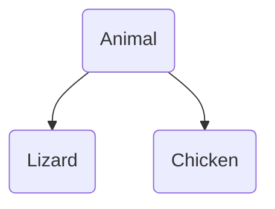

# 杂项讨论

## Item 32 在未来时态下发展程序

程序员书写软件的时候，需要考虑未来可能的需求，但是不要为了未来的需求一直等待下去。这种未来时态下的程序应当具备弹性、健壮性、可信赖度，是一种准备好为未来的需求而改变的能力，而不是一种把未来的需求具体化的实现。

+ 程序的维护者筒仓不是当初的开发者，所以设计和实现时应当注意到如何帮助其他人理解、修改和强化你的程序。在未来时态下，有可能依赖的类的地位发生了改变，新的函数也有可能会引发重载。要做到这一点，最好的方法是以C++本身的语言特性来描述程序，而不是依靠说明文件。
+ 任何一个类都会有默认定义的东西，如果不需要，请严令要求禁止或者屏蔽，否则未来的重新定义会导致很神奇的改变。
+ 不要做出令人大吃一惊的操作，如果你不知道什么叫不大吃一惊，就去看看内建类型的行为。
+ 只要编译没问题，就会有人做，你设计的`class`应当能尽力对这些不当行为有所制止。
+ 可移植代码不会让你满盘皆输。
+ 把系统改变带来的代码冲击局部化，换句话说，尽力减小系统改变时需要修改的代码数量。比如使用匿名的`namespace`或者文件内的`static`，`class`的`private`。
+ 注意书本上的内容，你需要批判的继承，有可能作者在书写结论时没有考虑很多情况。
+ 不论你的设计有多适合于修改，你必须要立足于现在的情况，毕竟你需要这个软件，提供玩真的个class，设计接口有利于共同的操作行为，让你的代码更一般化都是很好的行为。

## Item 33 将非尾端类设计为抽象类

如果需要给一个继承体系加入类的时候，不要给一个具体的，可以产生对象的类加加挂件，不然你处理的时候会很痛苦，一个更好的转换方式是和具体的类进行平级处理，然后通过锁定特殊的方法可以使用。

在一个这样的继承体系里面



如果我们不希望`Lizard`和`Chicken`可以互相赋值，但是同类不受到影响，那么我们可以：

```c++
Lizard& operator=(const Lizard& rhs);
Chicken& operator=(const Chicken& rhs);
Animal& operator=(const Animal& rhs);
```

这样子会让如下的代码钻空子：

```c++
Lizard liz1;
Lizard liz2;
Animal *pAnimal1=&liz1,*pAnimal2=&liz2;
*pAnimal1=*pAnimal2;
```

这样会有两个问题。

+ 针对`Animal`的指针修改只会修改子类的`Animal`部分，而不会涉及到子类部分的修改，这应该是大部分程序员不希望看到的。
+ 真的有很多人这样写程序（别说了我在这个样例之前也是不知道的）

一个解决办法是上`virtual`操作符，这样子赋值就会找到相对更正确的类（毕竟是指针操作，如果实在不行直接`->`指过去。但是这样会有另一个问题：我们打开了`Chicken`到`Lizard`的相互赋值的通道——指针指过去就行了，这不久滑稽了么？所以程序难就难在如何让用户容易的正确使用，不容易被误用。

为了解决这个问题，有一个方法是在赋值操作符里面加上`dynamic_cast`，如果转不出来直接报`bad_cast`异常，如果可以则说明是自己人，可以进行。

```c++
const Lizard& rhs_liz=dynamic_cast<const Lizard&>(rhs);
```

加个`try`就可以解决问题。如果你嫌同类还要处理异常和`dynamic_cast`麻烦的话，你可以考虑给自己类再写一个没有检查的，然后调用就行了。最后大概就长这个样子：

```c++
class Animal {
public:
    virtual Animal& operator=(const Animal& rhs){/*...*/}
};
class Lizard {
public:
    virtual Lizard& operator=(const Animal& rhs){
        return operator=(dynamic_cast<const Lizard &>(rhs));
    }
    Lizard& operator=(const Lizard& rhs){/*...*/}
};
class Chicken {
public:
    virtual Chicken& operator=(const Animal& rhs){
        return operator=(dynamic_cast<const Chicken &>(rhs));
    }
    Chicken& operator=(const Chicken& rhs){/*...*/}
};
```

麻烦吗？挺麻烦的，你还要折腾`bad_cast`异常。那有没有更好的解答？不好想，因为继承体系决定了这个问题。如果说简单的把`Animal`的操作符改成`private`，那么你直接拒绝了`Animal`的相互赋值，除非你希望这本身是抽象的，不然你应该不希望有这问题吧？

继承体系有问题就改继承体系，编译能出来的问题绝对不要放在运行期处理，这是写程序的根本，因为运行期会消耗更多资源，处理的结果却是一样的。既然`Animal`可以是抽象类，那么把`Animal`，`Lizard`和`Chicken`的共有部分抽出来（尽量不带有成员），组成一个抽象类，然后禁止互相赋值即可——一个`Animal`本身也不应该赋值给`Lizard`，之前的需求仅仅是因为`Animal`是`Lizard`的父类才不得不产生。

如果你不知道选定哪一个作为纯虚函数，那么你可以考虑把析构函数设为=0。在继承体系中，析构函数需要变成虚函数，而且不论是否是纯虚函数，析构函数必须要有实现。

接下来讨论一个更哲学的问题，什么叫在未来时态下发展程序。

刚才的问题的核心在于“通过基类的指针，进行赋值操作”，如果基类里面没有元素，那么继承是安全的。但是如果这个具体类之后又成员变量了，就进入了一开始的情况；如果一直都没有具体变量，那不应该是个“接口”吗？

这样的结果不是一定要求你在完成任何需求的时候都给一个具体类和一个抽象类，这样太折腾了，而且不是所有的类都会有这样扩展的可能。最好的处理方式是，如果你遇到了需要扩展的时候再去抽象。

如果你依赖的程序库中发生了这样的问题，那么你可以考虑的选项大概有这么几个：

+ 将你的具体类派生自既存的具体类，但是一定要注意验证assignment之类的问题。
+ 从程序库中继承自一个更高的抽象类，其中有大部分功能，这个可能比较折腾。
+ 按照你希望的功能实现自己的新类，换句话说，以一个数据成员的方式进行调用。
+ 直接砍掉多余的需求，这个可能会让甲方爸爸不开心的。

## Item 34 如何在一个程序中结合C++和C

C和C++的混合使用，必须要确认编译器能否产生兼容的目标文件。

### 名称重整

通常来说C++是必须要有名称重整的，所谓名称重整的意思是把一个函数名换成另一个函数名，以应对重载带来的名称冲突，但是C一般没有这个东西，如果你的C++文件在调用C的链接库时遇到了名称重整，然后就编译失败。如果意图避免这个问题的话，建议用这个：

```c++
extern "C" function();
```

不过不要认为又C就有Pascal。如果使用了这种技术，那么名称重整将会被压抑不发，因为主张相关函数用C写成。不过有两个事情需要注意下：

+ `extern`可以并联多个函数。
+ 如果你希望C++用但是C不用，那么建议`#ifdef __cplusplus`进行条件编译。

这里面有个更根本的问题是没有所谓的名称重整标准算法，不同的编译器可以独立的以不同的方法来重整名称，这也是一定要求兼容的原因。

### `static`s的初始化

通常来说你可能会对于`static`的初始化时机存在一个疑问，这里会给你解答。

在你写完`main`函数进行编译以后，程序会把用到的`static`变量在`main`函数运行之前初始化，在`main`运行结束以后进行析构。这一点有可能击破你自己的认知。

如果你希望在C中实现大部分，而C++只是做一个支持库的话，那么也建议你用C++写一个`main`，然后调用C写的`main`，大概就长这个样子。虽然说在这种情况下C写main比较合理，但是你无法保证`static`对象的构造和析构函数可以调用，当然每一家厂商都会针对这种情况提供语言之外的机制，细节请看文档。

```C++
extern "C"
int realmain(int argc,char** argv);
int main(int argc,char** argv);
```

### 动态内存分配

这一部分总之就一句话：`malloc`对应`free`，`new`对应`delete`，能不作死就不要作死。

### 数据结构的兼容性

如果没有继承、虚函数和虚基类这样的东西，C和C++对于数据结构中的内存排布应当是一致的，此时数据结构可以在C和C++之间安全往返。同样的，如果C和C++加入了一些非虚函数，那么也不会影响内存排布。如果加入了虚函数、虚基类等等影响内存结构的东西，那么这个游戏就玩不下去了。

## Item 35 让自己习惯于标准C++语言

STL是个好东西，本身也是一个具体内容的抽象，在抽象的过程中扩大了STL的适用范围，使其成为一个接口，只要符合这个接口的所有代码都能跑起来。当然，STL本身也提供了一些用到这些接口的类，用来满足日常的使用。