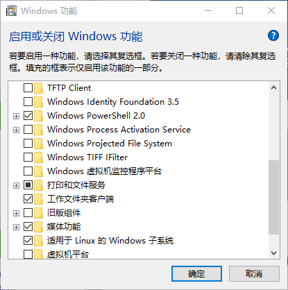
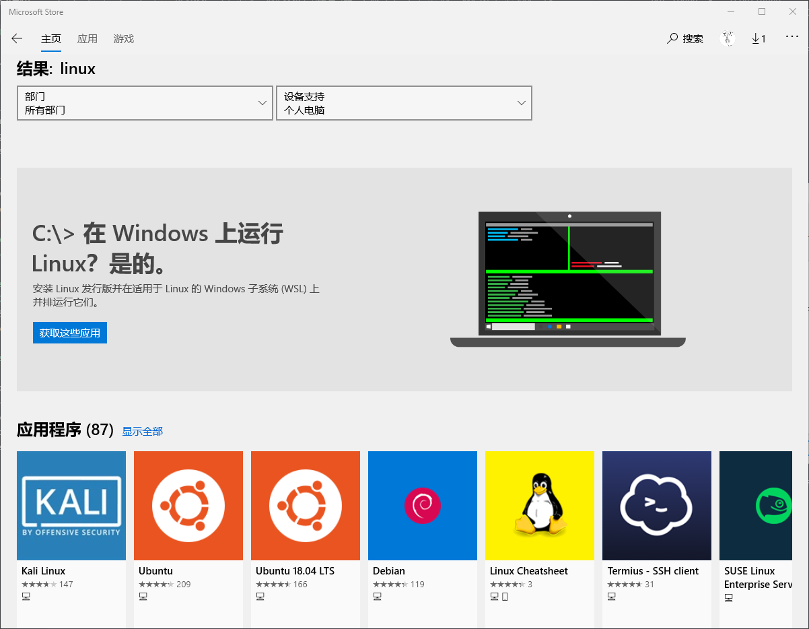
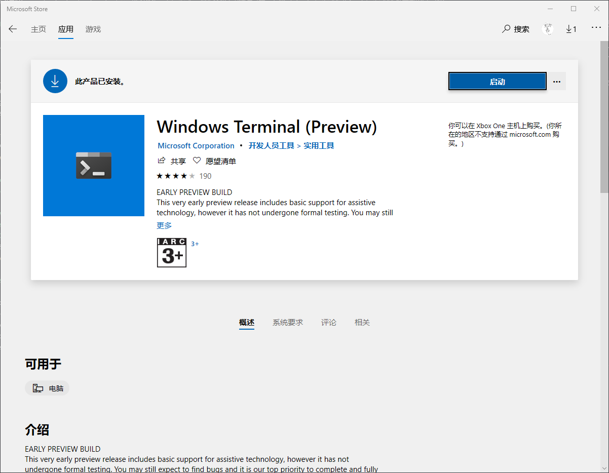

# wsl的LAMP苦逼调试过程，在此记录一下
## wsl是什么东西
[某一天巨硬CEO说了一句话：](https://cloudblogs.microsoft.com/windowsserver/2015/05/06/microsoft-loves-linux/)
```
Microsoft Loves Linux
```
于是乎就有了一个东西叫做，全称[Windows Subsystem for Linux](https://zh.wikipedia.org/wiki/%E9%80%82%E7%94%A8%E4%BA%8E_Linux_%E7%9A%84_Windows_%E5%AD%90%E7%B3%BB%E7%BB%9F)

对于wsl的配置，由于已经配好，所以出错过程只能做到尽可能回忆起来，但不保证全面，也有可能你没遇到我这个bug，也有可能遇到了我没遇到过的bug。

在安装qemu的时候甚至出现了一个"无法解决"的bug(别想了，404查不出来):
```
: not found: 5: ./configure:
: bad variable nameet: GREP_OPTIONS
```
但是在重装系统之后不可复现。windows本身就是一个很复杂的系统，平行弄一套wsl的复杂度不会低于windows。
## wsl的安装
### wsl 1
首先进入微软的功能选项，这里可以通过windows搜索进入。找到"适用于Linux的Windows子系统"这个选项，打上勾。



这一步也可以通过powerhell打开(注意管理员权限)：
```
Enable-WindowsOptionalFeature -Online -FeatureName Microsoft-Windows-Subsystem-Linux
```
之后进入微软的应用商店



之后出现问题的可以看下微软的[链接](https://docs.microsoft.com/zh-cn/windows/wsl/install-win10#for-anniversary-update-and-creators-update-install-using-lxrun)。
### wsl 2
如果想要开启功能，在wsl的基础上再打开虚拟机就可以，或者命令行：
```
Enable-WindowsOptionalFeature -Online -FeatureName VirtualMachinePlatform
Enable-WindowsOptionalFeature -Online -FeatureName Microsoft-Windows-Subsystem-Linux
```
然后把某个版本切换到wsl2，Ubuntu可以换成其他版本。
```
wsl --set-version Ubuntu 2
```
如果版本不够，会得到命令无法识别的输出
```C++
命令行选项无效: --set-version
```
## 进入wsl
如果想要进入wsl的话，可以考虑以下方式：
+ powershell中输入wsl
+ 打开新安装的UWP应用的图标
### 推荐微软自带的Termianl(开源)
首先贴出[地址](https://github.com/microsoft/terminal)。这个也可以在商店里面下载到，


之前的版本建议先下载Linux发行版，之后安装Terminal，否则可能会导致新装的识别不出来，你自己还要去找GUID，新版没这个问题了，Linux发行版安装的时候会自己把东西加到Terminal里面。

（怎么最近巨硬一点都不像开源公敌。。各种真香软件）由于是巨硬家的软件，所以在复制快捷键上面和windows特别相似，但是又有点不同。
+ 复制Ctrl+shift+v
+ 黏贴Ctrl+shift+c
+ Ctrl+shift+数字打开某一个终端，具体是哪一个可以看下拉菜单
+ 可以定制自己的快捷键和颜色主题(这个打开下拉菜单自己看，用的次数不多就没记快捷键，不过应该和VSCode一样是Ctrl+,)
### 软件源
进入之后就和Ubuntu没啥差异了(我安装的Ubuntu)，我参考的这个[vampire](https://os.vampire.rip/speedup.html)的链接进行配置，在这里也感谢这个教程给我安装qemu提供了巨大的支持，也感谢对于6.828的中文翻译。
```shell
sudo vi /etc/apt/sources.list
```
不放心的可以备份一下，打开以后敲一下i进入插入模式，然后把所有的注释掉，换成那里的其中一个就行，最好不要把很多都搞在一起，有可能会引发软件包名称冲突的问题。之后
```shell
sudo apt-get update
sudo apt-get upgrade
```
### apache2 php
相比于之后的内容，这部分可能比较波澜不惊，但是也有点小挫折。在现有的软件包状态下，php只有7.2，之后的就没有了，于是乎需要添加repo来支持更新的或者更老的。
```shell
sudo add-apt-repository ppa:ondrej/php
```
然后update一下，之后安装就行了，熟悉php开发的都知道，推荐5.6和一个最新的稳定版(这个时间点是7.3)。

除此以外，还有一个问题，就是apache2可能会遇到`Failed to enable APR_TCP_DEFER_ACCEP`错误，这里只需要`sudo vi /etc/apache2/apache2.conf`，然后在最后加一行就行了
```
AcceptFilter http none
```
### mysql
从我配置的记录来看，这里很有可能翻车，可能会卡各种bug，其中最离奇的bug是：
> mysql-server和mysql-client必须同时安装，先后安装会导致很神奇的问题，看不懂系列。

实际上，有mysql-8.0版本，但是在安装的时侯已出现了很神奇的bug，那个时候输入
```
sudo service mysql start
sudo service mysqld start
```
会得到mysql和mysqld的unrecognized service信息，然后输入`mysql -u root -p`，输入密码会获得sock无法链接的错误，除此以外运行`mysqld_safe --skip-grant-tables`会得到error日志无法写入，如果sudo打开则会提示不应该用sudo运行然后退出去。

我只能黑人问号了，不知道重装系统之后这个问题会不会好，至少现在5.7版本用的还是挺稳的，反正也是本地用。

安装之后如果不要求输入密码的话，就需要自己进入数据库改，这里就推荐这些了：
```
sudo service mysql stop
sudo mysqld_safe --skip-grant-tables
```
这里就会卡死，因为自我检查的最后是一个死循环，此时打开另一个窗口，运行`mysql -u root`就可以进入，之后
```
use mysql;
select * from user;
update user set authentication_string=password("123"),plugin="mysql_native_password" where user="root";
flush privileges;
quit
```
这样就可以了。这里的plugin是为了方便phpmyadmin访问，一次性改了这样就不用回头来改了。
### phpmyadmin
在安装完这个之后，直接`sudo apt-get install phpmyadmin`就可以安装，回车到底，具体选项是
+ apache2和lighthttpd中选择apache2
+ 第一次密码直接回车，由phpmyadmin随机产生（也可以自己输）
+ 第二次密码也直接回车，跳过随机密码的检验（如果是自己输入的话就要一样）
然后就可以用了。记得
```
sudo service apache2 start
sudo service mysql start
```
然后就发现欸我localhost/phpmyamdin输入地址的时候就没有反应了，咋回事啊？
欸我这里搜不到解决方法了，如果没记错的话，把`/etc/apache2/apache2.conf`再加一行识别phpmyadmin就可以完成了。
### phpmyadmin的Warning解决
这里的解决方法有两种
+ 下载新的phpmyadmin包，这个在[这里](https://www.phpmyadmin.net/)下载，具体内容就是覆盖，还要修改一下，怎么覆盖自己搜教程
+ 修改代码以解决你遇到的问题，这里一般会遇到1-2个错误，把代码文件名和行号复制出来搜索就可以知道哪里有问题了。
## 顺手提醒一下，wsl可以完成6.828的编译环境
有关内容请在MIT 6.828的repo中看，这里就不写了#滑稽。

对应内容在做完了以后放出（别说了去做，11月初要交）