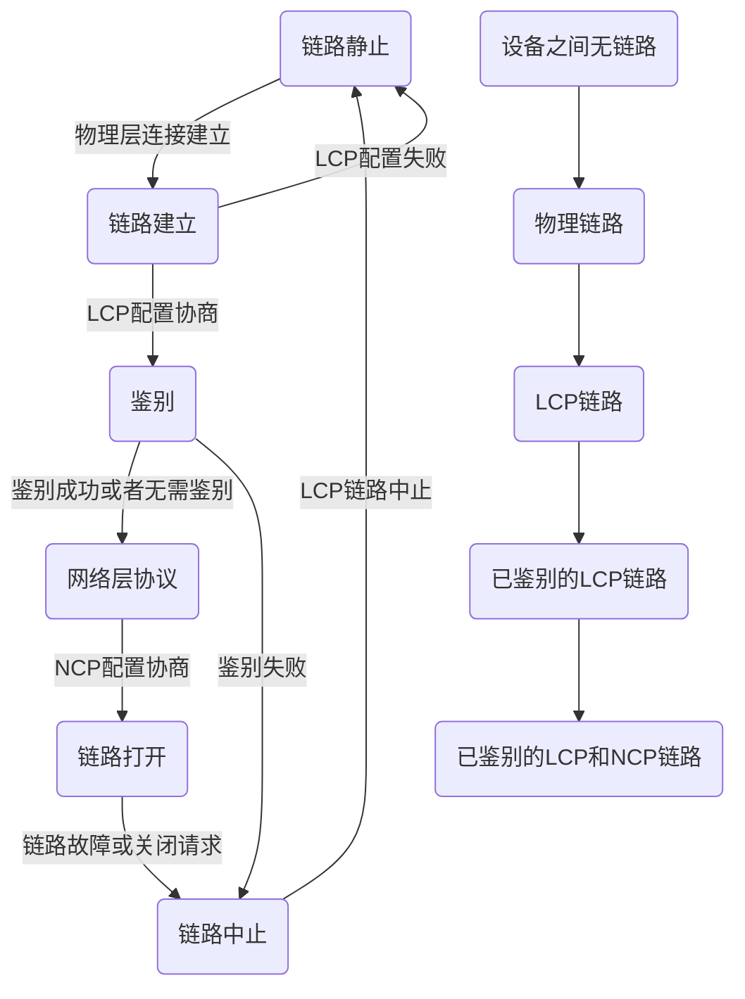

# 第三章 数据链路层

数据链路层使用的信道主要由以下两种类型： 

1. **点对点信道**。这种信道使用**一对一**的点对点通信方式。
2. **广播信道**。这种信道使用**一对多**的广播通信方式，因此过程比较复杂。广播信道上连接的主机很多，因此必须使用专门的共享信道协议来协调这些主机的数据发送。

本章最重要的内容是：

1. 数据链路层的点对点信道和广播信道的特点，PPP协议、CSMA/CD协议。
2. 数据链路层的三个基本问题：封装成帧，透明传输和差错检测。
3. 以太网MAC层的硬件地址。
4. 适配器、转发器、集线器、网桥、以太网交换机的作用以及使用场合。

## 3.1 使用点对点信道的数据链路层

### 3.1.1 数据链路和帧

所谓**链路**是从一个节点到相邻节点的一段物理线路，这段线路可以有线也可以无线，而中间没有其他的交换节点。**数据链路**是链路、协议相关的软硬件的组合。从另一个层面理解，数据链路是物理链路和逻辑链路的结合，**物理链路就是物理层设备，逻辑链路就是通信协议**。

**帧**是点对点信道的数据链路层的协议数据单元。在互联网中，网络层协议数据单元就是**IP数据报**。

### 3.1.2 三个基本问题

#### 封装成帧

在数据链路层封装的结果中，一般由帧首部+IP数据报（或者其他的装入数据）+帧尾部组成。首尾的一个重要任务是**帧的定界**。为了方便帧的传输，定义了一个**MTU**以控制传输长度不至于长到降低传输成功率。帧的首尾部自然会有一些控制信息。如果发现有帧的开始，但是没有结束，这是一个不完整的帧，应当舍弃。

如果使用ASCII码传输的时候，可以考虑使用ASCII中定义的开始(0x01，**EOH**)与结束(0x04，**EOT**)来进行帧定界。对于比较简单的也会使用这些默认设定。

#### 透明传输

这里的**透明**代表**当一个实际存在的事物看起来却好像不存在一样**。

发生条件是发现一个开始符以后遇到了一个多个结束符的情况，如果不做额外处理会导致提前结束接收，链路层协议会找到一个错误的边界。这里可以采用**字符填充**发解决这个问题，在之前的内容中，可以加入ESC（0x1B），此时如果需要发送0x1B，那么就发送两个0x1B即可，这样就完成了ESC的转义。

#### 差错检测

这里就要提到**CRC校验**。CRC的主要操作是把一串二进制码按照$k$位一分段，然后尝试给每一段添加一个$n$位的码，使其刚好在模2的算术意义下能被指定的$n+1$位整除。这里的模2意义可以简单的处理成异或。

这里需要指出的是如果在数据链路层仅仅使用CRC，那么只能做到对于帧的无差错接受，或者说能以**非常接近于1的概率认为传输过程中没有差错**。CRC**不能**对于帧与帧之间的关系进行评判。

帧与帧之间的关系除了正确顺序之外，还有**帧丢失、帧重复或帧失序**三种。过去OSI对于这类问题的探讨则是需要增加**帧编号**、**确认**和**重传**机制，即如果收到正确的帧就要向发送端发送确认消息，如果一段时间内没有发送则需要重发，直到有回复为止。

但是现在则是采取区别对待，因为网络环境的改善导致因链路质量不好而出错的概率大大降低。对于比较好的链路（比如有线传输），数据链路层不用**确认和重传**机制，如果数据链路层传输数据时出现了差错并需要改正，那么改正差错的任务交给上层协议完成；对于质量比较差的协议就需要确认和重传机制。

还有一个概念就是**误码率**，代表着一段时间内传输错误的bits所占所有bits的比率。

## 3.2 点对点协议PPP

以下内容没有完全来自于课本，[这个链接](https://blog.csdn.net/bytxl/article/details/50111971)和[这个链接](https://blog.csdn.net/lilonglong1100/article/details/52914021)是补充内容，对于PPP协议讲解的非常完整，但是缺陷是内容太长而很难被课本这样需要短小精悍的内容完整概括。

### 3.2.1 PPP协议是什么

PPP是一种数据链路层协议，遵循**HDLC（高级数据链路控制协议）族**的一般报文格式。PPP是为了在**点对点物理链路**(例如RS232串口链路、电话ISDN线路等)上传输OSI模型中的网络层报文而设计的，  它改进了之前的SLIP协议中的缺陷：只能同时运行一个网络协议、无容错控制、无授权。PPP是现在最流行的点对点链路控制协议。 

PPP几个重要部分是**LCP协议**，**NCP协议**，**鉴别**，**PPP扩展协议**，这些具体的内容会在PPP协议状态机中看到分布，而对于LCP，NCP，鉴别则会花费很多篇幅来介绍，因为PPP的核心就在于这里：**协商和验证**。

### 3.2.2 PPP协议状态机

从这里开始，你会不可避免地遇到：流程图，描述帧格式的图片。



在上图的各种阶段中，这里会给出一个简要的介绍。

1. **链接建立**只需要**物理层的链接建立**，此时双方可以观察到对方的载波，此时的载波是没有意义的，可以被认为是杂音。
2. 连接建立完成以后就是**LCP协商**，这是一个握手过程，双方发送**基于PPP协议的LCP协议报文**完成后续联络的条件交互，如果把所有东西都拿出来的话对于读者是灭顶之灾。
3. **鉴别阶段**是可以被跳过的，这里常见的有两种方式：CHAP和PAP，对应内容会在后面的流程图讲解。鉴别阶段使用链接协商阶段确定下来的鉴别方式来为连接授权，以起到保证点对点连接安全，防止**非法**终端接入点对点链路的功能。**链路质量的检测**也会在这个阶段同时发生，但协议规定不会让链路质量的检测无限制的延迟验证过程。注意这里的鉴别是单方面的，可以双方采用不同的鉴别方式，比如A对B使用CHAP，但是B只对A进行PAP。
4. **NCP协商**阶段和LCP协商如出一辙。
5. 此时**链路打开**，可以正常通信。如果任何一段收到**LCP或者NCP的链路关闭报文**或者其他没有预料的原因，会使整条链路中止，PPP会话结束。不过一般而言协议不要求NCP有关闭链路的能力，所以大部分都是LCP发出来的东西。

### 3.2.3 PPP协议的帧格式

后续的帧格式都在PPP协议上进行，也就是说，后续的帧格式地全部都是PPP协议的数据部分。这对于PPP协议是非常必要的。

| Flag | Address | Control | Protocol |      Data       | Pad  |   FCS    | Flag |
| :--: | :-----: | :-----: | :------: | :-------------: | :--: | :------: | :--: |
| 0x7e |  0xff   |  0x03   | 1/2bytes | Up to 1500bytes |  ?   | 2/4bytes | 0x7e |

其中Flag，Address，Control，都是PPP协议中写死的变量。这里可能会有一个问题：为什么地址也是写死的？几乎所有协议都需要一个发送端和一个接收端，当然有可能没有发送端，每个协议都有适配于自己的接收端地址。

但是PPP有一个大的前提：**这是一个点对点网络，本身就可以唯一标识对方**。

FCS表示循环冗余码，可以使用CRC来验证。对于协议部分则有如下的划分。

| Protocol            | 对应的Data域的含义            |
| :------------------ | :---------------------------- |
| 0x0\*\*\*-0x3\*\*\* | 网络层的数据报文              |
| 0x4\*\*\*-0x7\*\*\* | 与NCP无关的第整流量           |
| 0x8\*\*\*-0xb\*\*\* | 网络控制协议（NCP）的数据报文 |
| 0xc\*\*\*-0xf\*\*\* | 链路控制协议(LCP)的数据报文   |

其中比较经典的取值：

| Protocol | 信息字段        |
| :------- | :-------------- |
| 0x0021   | IP数据报        |
| 0x8021   | 网络控制数据NCP |
| 0xC021   | 链路控制数据LCP |
| 0xC023   | 安全性认证PAP   |
| 0xC223   | 安全性认证CHAP  |

### 3.2.4 LCP协商

#### LCP的内容

LCP中对于PPP的数据部分进行了一些扩充。很显然此时PPP里面的Protocol应当是0xC021。

|  Code  | Ident  | Length | LCP Data |
| :----: | :----: | :----: | :------: |
| 1bytes | 1bytes | 2bytes | Variable |

上述表格中的字段解释分别如下：

+ Code：看表格。 

  | Code | Name                              |
  | :--: | :-------------------------------- |
  | 0x01 | Configure-request，配置请求数据帧 |
  | 0x02 | Configure-ACK，配置确认数据帧     |
  | 0x03 | Configure-NACK，配置否认数据帧    |
  | 0x04 | Configure-REJECT，配置拒绝数据帧  |
  | 0x05 | Teminate-request，终止请求数据帧  |
  | 0x06 | Terminate-ACK，终止确认数据帧     |
  | 0x07 | Code-REJECT，代码拒绝数据帧       |
  | 0x08 | Protocol-REJECT，协议拒绝数据帧   |
  | 0x09 | Echo-request，回应请求数据帧      |
  | 0x0A | Echo-reply，回应应答数据帧        |
  | 0x0B | Discard-request，丢弃请求数据帧   |
  | 0x0C | Identification，用于管理操作      |
  | 0x0D | Time-Remaining，也用于管理操作    |

+ Ident：LCP报文的序列号，用于匹配Request和Reply报文。由Request的发送者生成，在后续的序列帧中递增，对于应答报文，Ident的值则**复制**过来。

+ Length：LCP数据报文长度，就是这四个字段的综合。

+ LCP Data：LCP数据报文。

#### 链接的配置

实际上这又是一个学问，从前面的内容可以看出，报文分为三种：链路配置报文，链路中止报文和链路维护报文，在表格中分别对应1\~4，5\~6，其他。

链路配置报文则还有两张表格需要处理，一张是LCP Data的继续分解，一张是配置Code的含义表格。特别要注意的是，Request可以在LCP Data中写多个，区分他们的主要方法是自带的长度，表格中的内容不一定全面。

| Code-LCP | Length-LCP | Data-LCP |
| :------: | :--------: | :------: |
|  1bytes  |   1bytes   | Variable |

| 类型 |                       参数选项                       |
| :--: | :--------------------------------------------------: |
| 0x00 |                         保留                         |
| 0x01 |          Maximum-Recieve-Unit，最大接收单元          |
| 0x02 |    Async-Control-Character-Map，异步控制字符映射     |
| 0x03 |          Authentication-Protocol，鉴权协议           |
| 0x04 |              Quality-Protocol，质量协议              |
| 0x05 |                  Magic-Number，魔数                  |
| 0x06 |                    CBCP，被叫回呼                    |
| 0x07 |         Protocol-Field-Compress，协议域压缩          |
| 0x08 | Address-and-Control-Field-Compress，地址和控制域压缩 |
| 0x0D |                 Multilink-Protocol，                 |

在配置的时候，会有三种情况需要考虑。

1. 接收方能**识别并且接受**发过来的配置内容，会给对方发回一个Configure-ACK报文，内部内容则**完全复制**即可，换句话说就改一个Code。
2. 接收方**能识别**发送过来的所有数据选项，但是对于内容**不是完全认同**，那么就需要对于**不认同的部分**发送Configure-NACK报文，把对应选项**修改成自己期望的样子**。
3. 接收方**不能识别**所有的发送端的数据选项，那么应当返回一个Configure-REJECT报文，里面**只复制一些不能识别的内容**。下一回发送方应当重复发送这些数据，并去掉这些内容，这样就能确认删除掉不能识别的了。

对于配置则是循环流程，只要有不满足要求的就一直进行下去，直到时间到头。

#### 链接的终止

在LCP建立以后，并**没有立刻释放**掉，而是在整个链路需要结束会话的时候才会交给LCP发起链路中止的报文。

LCP报文中提供了一种机制来关闭一个点对点的连接，想要关断链路的一端A会**持续发送**Terminate-Request报文，直到收到一个Terminate-Reply为止。接收端B一旦收到了一个Terminate-Request报文后，必须回应一个Terminate-Reply报文，同时等待对端A先将链路断开后，再完成本端的所有断开的操作。

#### 链接的维护

+ 如果Code域不是希望的样子，那么就发送一个Code-REJECT报文。
+ 如果Protocol域不合法，就发送一个Protocol-REJECT报文，这样发送端拿到拒绝请求之后就会停止发送这报文了。
+ Echo报文则主要检测双向链路上自环的问题，涉及到**魔数**（Code-Data项的0x05）。

### 3.2.5 鉴别

鉴别分为两个，一个是**PAP（口令验证协议）**和**CHAP（挑战握手验证协议）**。这里更多会涉及到密码学的内容，请优先对于密码学有所了解再过来。

#### PAP

```sequence
Client->Server: Auth-Req
Server->Radius: Auth-Req
Radius->Server: Auth-ACK
Server->Client: Auth-ACK
```

#### CHAP

````sequence
Client->Client: Wait
Server->Client: Challenge(CHAP)
Client->Server: Response
Server->Radius: Response
Radius->Server: Success
Server->Client: Success
````

解释：

+ Server和Client有相同的加密规则。
+ Client计算Server发来的密钥，和Radius进行比对，如果过了就是过了。

### 3.2.6 NCP协商

首先到了这一步，PPP的协议域应当是0x8021。然后就是数据域的内容，这里相对于LCP就简单多了，直接放表格。

|  Code  | Ident  | Length | NCP Data |
| :----: | :----: | :----: | :------: |
| 1bytes | 1bytes | 2bytes | Variable |

| Code-NCP | Length-NCP | Data-NCP |
| :------: | :--------: | :------: |
|  1bytes  |   1bytes   | Variable |

对于第一个Code，可以选择的一般都是Configure的四个内容（0x1\~0x4）。对于Code-Data则有三种选择。

| 类型 |             参数选项              |
| :--: | :-------------------------------: |
| 0x01 |   IP-Addresses，IP地址选项配置    |
| 0x02 | IP-Compression-Protocol，压缩协议 |
| 0x03 |      IP-Address，IP地址配置       |

## 3.3 使用广播信道的数据链路层

### 3.3.1 局域网的数据链路层

局域网最主要的特点是：**网络为一个单位所拥有，且地理范围和站点数目均有限**。局域网的网络拓扑有**星形网**（Hub实现），**环型网**，**总线网**和树形网（书上没有提到过）。多台主机最主要考虑的问题是共享信道，主要有两种解决方法，一个是**静态划分信道**，一种是**动态媒体接入控制**（随机接入和受控接入）。随机接入需要解决碰撞检测和解决的网络协议。

对于局域网而言，链路层被拆解成两个子层，**链路逻辑控制LLC**和**媒体接入控制MAC**，不过在1990年代以后，LLC协议就已经消失了，主要原因是DIX Ethernet V2的占有率提升和IEEE 802.3占有率几乎消失。

现代的计算机连入局域网都会使用适配器（网卡），网卡的硬件地址（MAC地址）会在适配器中写死，而IP地址则放在计算机的存储器中。在连入完成以后，网卡通过中断的方式告知计算机有帧需要接受，而计算机需要发送IP数据报时只需要把东西发给网卡就可以把东西丢出去，得益于PPP协议和当下的状况，计算机的数据从网卡走出去以后一般都会走向一个类似于集线器的终端，之后把数据发给其他网卡。

### 3.3.2 CSMA/CD协议

在早期的以太网中，通常会使用**总线型**来处理，而且会采用**无连接**的工作方式，即**不必先建立连接就可以直接发送数据，适配器对发送的数据帧不进行编号，也不要求对方发回确认**。这样处理的原因是在比较近的局域网中，信号的质量往往很好，因此网络必须要尽最大的能力进行速度提升，代价就是降低一定的可靠性。

除此以外，以太网发送数据都是用**曼彻斯特编码**，优点和缺点都非常明显。优点显然是可以根据电压很方便把数据转移出来，缺点显然是这个频带宽度……

总线存在一个问题，就是同一时间只能有一个终端在发送数据，否则就会产生干扰，因此产生**CSMA/CD协议**来解决这个问题。核心在于以下三点：

1. **多点接入**。即多个计算机在这个网络中。
2. **载波监听**。不论在发送之前还是在发送中，每个站都必须不停地检测信道。
3. **碰撞检测**。适配器边发送数据边检测信号的变化，如果超出预期则直接停止全部的发送，并产生一个等待时间，之后再发送。

于是乎需要解释一个问题：如果保证同一时间只有一个站点在发送数据，即在信道上没有信号的时候发送不就行了吗？其实这个问题忽略了一个日常情况下可以忽略的条件：时延。

在局域网的分析中，假设单程端到段的时间为$\tau$，在信号传送到对面之前的$\delta$时间内对面也发送了数据，那么就会在$2\tau-\delta$的时刻，本机接收到了对面发送的信息正在干扰自己，因此需要退避。而$0<=\delta<\tau$，那么就会有一个退避算法的解释。

1. 以$2\tau$作为**基本退避时间（争用期）**，在这一段时间内，两边都应该停止发送数据。

2. 考虑到更多的机器一起工作，因此需要考虑**额外的时间**才开始重传，这一段时间应当是争用期的整数倍，假设为$r$。这个时间应当在发现数据存在冲突之时开始计算。
   $$
   r\in[0,2^k-1)
   $$

   $$
   k=min(重传次数,10)
   $$

3. 当$k=16$还是传不出去，那么应该丢弃该帧，并向上层报告。

4. 在10Mbps以太网中，默认$2\tau=51.2\mu s$，这意味着这段时间发送了64字节的内容。

但是这会发生一个不小的问题：如果帧太小的话，那么，就会在A发送出去以后B没有接收到之前，B也发送了数据，但是双方都不知道被干扰了，因此必须要求64字节是起码要有的，同时要求长度小于64字节的帧都是由于冲突而异常终止的无效帧。

除此以外，还有**强化碰撞**的概念，就是认为发生一个碰撞来让所有用户知道了碰撞，只需要发送一个32/48bits的数据。以太网还要求帧的最小间隔是9.6$\mu s$，这是为了方便刚刚收到数据帧的站进行数据清理。

### 3.3.3 使用集线器的星型拓扑

总线要求粗同轴电缆，因此存在一个成本问题，于是后来就是细同轴电缆，最后是双绞线和一个集线器就可以解决问题。

集线器还有一些特点如下：

1. 从表面上看，这是一个星形网，但是在逻辑上任然是一个总线网，使用的还是CSMA/CD协议，同一时刻最多只允许一个站发送数据。
2. 一个集线器有很多个接口，因此，一个集线器像一个多接口的转发器。
3. 集线器工作在物理层，仅仅是简单的转发比特，**不**进行碰撞检测。
4. 集线器采用了专门的芯片，进行自适应串音回波抵消，每个比特再转发之前进行再生整形并重新定时。

### 3.3.5 以太网的MAC层

#### MAC地址

MAC地址又名**硬件地址，物理地址**，用于网络中的标识，而怎么找到这个MAC是路由的任务。严格的讲，局域网的“地址”应当是每一个站的“名字”或标识符。

对于MAC而言，IEEE使用了48位来标识每一个网卡，其中前24bits用于标识**组织唯一标识符OUI**，后面24bits交给厂家自己处理，只要不重复就行，这种方法得到的叫做**EUI-48(适配器标识符，Extended Unique Identifier)**。注意：

1. 有可能几个公司一起买一个EUI，也有可能一个公司买了几个EUI。
2. 前面24bits不一定所有的都用于OUI，IEEE规定**I/G(Individual/Group)**位为第一字节的最低位，如果为0表示单个站地址，如果为1表示组地址，用于多播。
3. IEEE同时把第一字节的最低第二位定义为**G/L(Global/Local)**位，如果位0表示**全球管理**（全球内唯一），如果为1则是**本地地址**，这时用户客人已分配网络上的地址。采用2字节地址字段时全都是本地管理。但是以太网似乎不想管这玩意。

所有的适配器应当都能识别**单播**和**广播**，而**多播**则通过编程方法来识别。除此以外以太网控制器可以设置成为**混杂方式**，不管发生了啥都记录下来，这里面就有可可乘之机，这种使用方法对于两类人特别有用：黑客和网络工程师。

#### MAC帧

MAC帧有两种标准，一种是以太网V2标准，一个是IEEE的802.3标准，不过更多的是V2标准这看上去是平行于PPP帧的一种标准。在IP层下来的数据前面加上一些东西。


其中目的地址和源地址是MAC地址，类型是对于上一层使用的协议的标注，比如IP数据报则是0x0800，而0x8137则是NovellIPX发过来的，最后的FCS自然是检验序列。不过MAC帧有一个问题，就是什么时候结束？实际上因为使用的是曼彻斯特编码，因此根本不需要，在最后的时候输出电压也就不会改变了，而需要发送的时候必然会在中间跳变。

在MAC帧包装完成之后，需要在之前加入8bytes用来时钟同步。其中前面7bytes用于时钟同步，只有字节码10101010，最后一个bytes用于帧开始定界符10101011。这个时候，要求MAC帧超过64字节用于CSMA/CD，这意味着IP数据报至少要46个字节，如果长度不够则需要强行添加内容，在返回给IP协议时，因为IP协议的第一个字段就是长度，所以不需要做什么判断。

## 3.4 扩展的以太网

### 3.4.1 在物理层扩展以太网

就是用集线器树状扩展以太网。

优点：

+ 原来不同碰撞域的局域网计算机能够跨碰撞域的通信。
+ 扩大了局域网覆盖的地理范围。

缺点：

+ 碰撞域增大了，但是总的吞吐量没有提高。
+ 如果不同的碰撞域使用不同的速率，那么连接在一起的时候就是所有的速率里面最低的速率运行。

### 3.4.2 在数据链路层扩展以太网

最早的方法时使用网桥，根据MAC帧的目的地址进行转发和过滤，但是注意网桥只能链接两端。后来1990年出现了**交换式集线器**，很快淘汰了网桥，常被称为**以太网交换机**，虽然本质上是多接口的网桥，一般工作在全双工方式。相互通信的主机都是独占传输媒体，无碰撞的传输数据。

最大的区别在于以太网交换机有缓存能力，可以在数据繁忙的时候暂存一下数据。和网桥相似的地方在于**帧交换表**，可以自学习了解每个端口放了什么主机。只有在发送端发送数据的时候，才会把接口和主机信息进行映射。如果学习过的端口过了一段时间就会自动删除。

但是交换机会存在一个bug，就是在进行冗余设计的时候会把以太网交换机的端口互联，从而发生绕圈子的情况，这个问题在802.1D标准协议中制定的**生成树协议STP**，在不改变拓扑的情况下剪掉某些逻辑上的链路。

以太网有几大根基，其中两个是CSMA/CD协议和以太网的帧格式，在交换机出现以后CSMA/CD协议已经消失。

### 3.4.3虚拟局域网

**虚拟局域网VLAN**，在IEEE 802.1Q中定义是这样的：

> 虚拟局域网VLAN是由一些局域网网段构成的与物理位置无关的逻辑组，而这些网段具有某些共同的需求。每一个VLAN的帧都有一个明确的标识符，指明发送这个真的计算机属于哪一个VLAN。

虚拟局域网可以把连接在同一个交换机的计算机分隔开，并且可以跨越交换机，这有效限制了接收广播信息的计算机数。在**802.1Q**标准下，加入一个4bytes的VLAN标记，其中前面两个字节为定死的0x8100，后面的为用户优先级，**规范格式指示符CFI**和**VLAN标识符VID**。

## 3.5 高速以太网

### 3.5.1 100BASE-T以太网

1995年IEEE把100BASE-T定位正是标准，代号IEEE 802.3u，可以进入全双工方式，也可以在半双工方式下工作。注意：**细缆以太网升级到快速以太网的必须重新布线**。而且，因为速度的提升，以太网帧的长度不能改变，因此争用期减小为1/10，帧之间的最小间隔也是1/10。

以太网有一个很重要的参数a，这个参数是以太网传输数据效率的标志，为了高效，a必须很小。而且a满足
$$
a=\tau/T_0
$$
众所周知，$T_0$是帧长度和速度的比值，帧长度没有减小，速度上升了10倍，因此$\tau$必须减小到1/10，进而最大长度变成了100m。

### 3.5.2 1Gbit以太网

1997年IEEE通过802.3z标准以支持1Gbit的以太网，也是现在基本普及的网络，甚至部分城市的宽带已经不是100BASE-T以太网能容纳得了的了。这种网络在半双工条件下使用CSMA/CD协议，但是全双工就不使用。在半双工条件下，不能单纯减小最大长度了，10m根本不够用，因此Gbit以太网的最大长度还是100m，但是采用了**载波延伸**的方法，最短帧长不变，但是争用期长度变成了512字节。

但是这又会引来一个问题，64字节的帧填满到512字节，会导致数据的利用率极大降低，因此Gbit以太网新加了一个功能就是**分组突发**，可以把很多个短帧进行合并到满足要求。

### 3.5.3 10Gbit以太网和更快的以太网

只工作在全双工模式，也不使用CSMA/CD协议，因此传输距离大大提高了，只需要考虑信号衰减。

### 3.5.4 使用以太网进行宽带接入

+ 以太网接入的重要特点是它可提供双向的宽带通信，并且可根据用户对带宽的需求灵活地进行带宽升级。 
+ 采用以太网接入可实现端到端的以太网传输，中间不需要再进行帧格式的转换。这就提高了数据的传输效率和降低了传输的成本。 