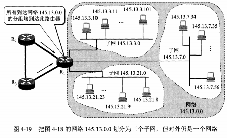

# 第四章 网络层

这一章主要解决网络互连问题。本章最重要的内容是：

+ 虚拟互连网络的概念。
+ IP地址与物理地址的关系。
+ 传统的分类的IP地址和无分类域间路由选择CIDR。
+ 路由选择协议的工作原理。

## 4.1 网络层提供的两种服务

在IP和路由这两个概念诞生之前（或者和这两个概念没有什么关系），数据应该如何传送出去？

+ 在创建的时候需要**预先进行通道的分配**，这是**面向连接**的。专有的通道意味着**可靠交付**，再加上可靠的网络协议，就可以保证数据无差错，无丢失，无重复地达到终点。这种被称为**虚电路服务**。
+ 把数据切片最小化成分组独立发送，只**提供简单灵活、无连接的、尽最大努力交付的数据报服务**。这种方式不提供服务质量的承诺，因为有可能出错、丢失、重复或者失序错误。

一开始对于电信网络选择的是虚电路服务，因为这种方式考虑到了电话这种非智能设备的处理能力和设备的使用情景：**低处理能力，高可靠性要求**，因此只能选择由电信网络来处理这个信号传输。计算机网络尝试复制但是始终无法推广，直到发现了数据报服务，充分考虑到了计算机强大的处理能力，对于可靠性的要求没有这么高，甚至错误顺序可以重排。互连网能够发展到今日的规模，充分证明了当初采用这种设计思路的正确性。

## 4.2 网际协议IP

网际协议IP是TCP/IP体系中最主要的两个协议之一，也是最重要的互联网标准协议之一。网际协议IP又称为Kahn-Cerf协议，是因为这两个人共同研发的这个玩意，而我们所称的**IPv4和v6**是第四个版本和第六个版本，也就是说1\~3和版本5都没使用过。

与IP配套的还有三个协议：

+ ARP协议，也是**地址嵌套协议**。
+ ICMP协议，也就是**网际控制报文协议**。
+ IGMP协议，也就是**网际组管理协议**。

其中ARP协议需要被IP调用，而ICMP和IGMP主要是调用IP协议。而网络层常被称为网际层或者IP层，这也强调了IP的重要性和这是由很多网络构成的互联网络。

### 4.2.1 虚拟互连网络

第二章讲解的是如何把01比特流发到其他地方，第三章讲解的是从数据链路层来看数据的传输，并且引入了物理地址和交换机，解释了点对点传输和碰撞。在[Wikipedia](https://zh.wikipedia.org/wiki/数据链路层)中指明了

>在两个网络实体之间提供数据链路连接的创建、维持和释放管理。构成数据链路数据单元（frame：[数据帧](https://zh.wikipedia.org/wiki/數據幀)或[帧](https://zh.wikipedia.org/wiki/訊框)），并对帧定界、同步、收发顺序的控制。传输过程中的[网络流量控制](https://zh.wikipedia.org/wiki/網路流量控制)、差错检测和差错控制等方面。
>
>只提供导线的一端到另一端的数据传输。

由于在一个局域网中，可以考虑仅仅使用点对点传输+广播来处理基本所有的需求，但是一旦网络变得很大，那么交换机内部存放的条目是不可接受的，因此需要分配子网络。而且用户需求的网络多种多样，加上商业竞争的存在，这些子网络之间必然会有差异，比如

+ 虽然以太网的名气非常巨大，但是**不一定是唯一**的一种网络，MAC这个说法在以太网中（802.x）存在，在比如说4G，5G这类的移动网络中是不存在的。
+ 智能家居中Zigbee和蓝牙、Wi-Fi连接的差异，这在米家中经常看到。

在不同的网络层次，很显然会有不同的连接方式。

+ 在物理层使用的叫做**转发器或集线器**。
+ 在数据链路层使用的叫做**网桥或交换机**。
+ 在网络层使用的叫做**路由器**。
+ 在网络层以上使用的叫做**网关**。
+ 当然有很多TCP/IP的文献把路由器当网关用了。

虚拟互连网络就是逻辑互连网络，它承认网络之间的差异，但是在兼容的协议下可以被认为是一种统一的网络。于是使用IP协议构造出来的叫做**IP网**。而**互联网也就是在覆盖全球的IP网上面走TCP协议**。

在这样的网络下，看上去一个主机可以和另一个主机能直接联络，实际上这在没有转发的情况下是不可能实现的。也正是因此，存在**直接交付**和**间接交付**两种说法，具体在什么情况发生顾名思义即可。最后采用原书中的一幅图来配套解释。

看到这里你可能会提出一些问题：

+ 这个路由表是怎么来的，如何使用？
+ 在本章和之前的知识中，MAC是数据链路层的东西，IP是IP层的东西，我们已经解释了在MAC上为什么还有一个IP，但是如何合理搭配使用两者及其算法才可以完成传送的任务？

### 4.2.2 分类的IP地址

有关IP的文档最重要的就是RFC 791。IP地址现在由**互联网名字和数字分配机构ICANN**进行分配，每一个IP地址就是给每个连在互联网上的主机分配一个在全世界范围内统一的32位标识符。IP编址方法经历了三个历史阶段。

+ **分类的IP地址**。这是两级IP，在这一块会有讲解。1981年通过。
+ **子网的划分**。这是三级的IP，在下一部分会有讲解。标准写进了RFC 950中，1985年通过。
+ **CIDR（超网）**。这是无分级IP，和子网划分会有讲解。1993年提出以后很快应用。

分类的IP地址分为两段，第一段是**网络号**，第二段是**主机号**，两者拼接即成32位，并且被分为了五类。

+ A类地址，二进制0开头，网络号占据8位，主机号占据24位。单播地址。
+ B类地址，二进制10开头，网络号占据16位，主机号占据16位。单播地址。
+ C类地址，二进制110开头，网络号占据24位，主机号占据8位。单播地址。
+ D类地址，二进制1110开头，作为多播地址。多播地址。
+ E类地址，二进制1111开头，保留。

IP的表示方法则主要由两种，一种是对于人而言比较好记忆的**点分十进制**，比如8.8.8.8，一种是对于计算机而言比较好计算的二进制，8bit一分，一共32bit。

不过要注意的是，在所有IP中有一些是不建议使用的，具体见下表。

| 网络号 | 主机号         | 源地址使用 | 目的地址使用 | 代表的意思                               |
| ------ | -------------- | ---------- | ------------ | ---------------------------------------- |
| 0      | 0              | 可以       | 不可以       | 本网络上的本主机                         |
| 0      | host-id        | 可以       | 不可以       | 在本网络上的某台主机host-id              |
| 全1    | 全1            | 不可以     | 可以         | 只在本网络上进行广播（各路由器都不转发） |
| net-id | 全1            | 不可以     | 可以         | 对net-id上的所有主机进行广播             |
| 0x7f   | 不是全0或者全1 | 可以       | 可以         | 用于本地软件进行环回测试                 |

因为有这些的影响，会导致ABC网络的网络号或者网络主机数目的减少，具体的就是：

| 网络类别 | 最大可指派网络数 | 第一个  | 最后一个    |
| :------- | ---------------- | ------- | ----------- |
| A        | 126              | 1       | 126         |
| B        | $2^{16-2}-1 $    | 128.1   | 191.255     |
| C        | $2^{24-3}-1 $    | 192.0.1 | 223.255.255 |

对于IP则应当由如下的特点：

+ IP是一个分等级的地址结构。在一定程度上，IP地址管理机构不需要具体到每一个IP的管理，只需要注意网络号的分配即可。而且路由器可以通过网络号来转发分组，这对于寸土寸金的路由器而言是必须要有的。
+ 实际上IP地址是标志一个主机（或路由器）和一条链路的接口。如果一个主机在两个网络上，就必须要有两个对应的IP地址，称之为**多归属主机**。显然一个路由器应当至少有两个IP地址，实际上，一个路由的每一个接口都有一个IP。
+ 在IP的视角下，用**转发器或网桥连接起来的网络还是一个网络**，因为网络号是一样的。连接不同的网络号就必须要使用路由器。
+ 所有分配到网络号的网络是**平等**的。
+ 两个路由器直接相连时，在连线两端的接口处，可以指明也可以不指明IP地址。

### 4.2.3 IP地址与硬件地址

这里将会解答一个问题的一部分：

> 在本章和之前的知识中，MAC是数据链路层的东西，IP是IP层的东西，我们已经解释了在MAC上为什么还有一个IP，但是如何合理搭配使用两者及其算法才可以完成传送的任务？

MAC被称为**硬件地址**（物理地址），主要是因为在出厂时就被写入到网卡的ROM中。而IP与之对应的就成为了**逻辑地址**，因为IP是使用软件实现的。同时MAC和IP负责的主要位置有所不同：MAC负责链路层和物理层，而IP则是网络层以上。

在处理的时候，IP是不会变的（除了NAT以外），而MAC经过一个路由器就会改变一次，改成什么东西则取决于路由表和终点IP。在这一段中，有几点需要解释一下：

+ MAC仅记录了**当前节点和下一步**应该去往哪里，而IP记录了发送数据的**源和目的地址**。
+ MAC一直在变化，对应了数据链路层的PPP(oE)协议。

这里千万要注意这一些内容，因为这有可能会影响计算机网络的理解，而且和书上讲的不是一样的：

+ IP层屏蔽了IP层以下的内容。虽然书上只是讲解了802.3，也就是以太网、有线连接，但是实际上数据链路层还有很多其他的实现，**有可能某种实现方式没有MAC这种说法（比如4G，5G），也有的可能会使用到（比如802.11）**。因此IP层必须要有自己的一种定址方式。
+ IP的定址方式应该在一个足够大的网络环境下能比较方便定位到子网络，换句话说，IP地址完成了一个重要的任务：**IP到MAC的映射**。因为每一个用户买的设备基本不可能所有的设备都是一个东西。如果只有一个MAC地址，那么子网掩码将会完全失效，路由条目需要重新设计，针对不同的MAC地址进行不同的操作。然而在这个情况下，MAC的爆炸增长和无序会让路由器不堪重负。
+ 在一个网络足够复杂的时候，**仅仅**使用交换机必然会带来广播风暴，这不是仅仅依靠VLAN能解决的事情。

讲解到这里，我们尝试解决了一个问题的一部分，了解了IP层的大致工作方式，你有可能会提出以下问题：

+ 这个路由表是怎么来的，如何使用？可以先假设这个网络已经比较稳定，此时路由表可以获得一个比较好的结果，但是不一定能获得最优解。
+ 在传送IP数据报的时候，需要知道四个东西，分别是本机和目的地址的IP，和本机和下一站的MAC。在假设路由表是比较稳定的情况下，**下一站的MAC**是不了解的，这个怎么回答？

### 4.2.4 地址解析协议ARP

这里将会解答一个问题：

> 在传送IP数据报的时候，需要知道四个东西，分别是本机和目的地址的IP，和本机和下一站的MAC。在假设路由表是比较稳定的情况下，下一站的MAC是不了解的，这个怎么回答？

顺便提一句，ARP协议是从IP找到了MAC，同样也有RARP完成反操作，只不过有DHCP协议能完成上述这一点就没有讲解。而且ARP在IPv6中被NDP取代了。

ARP完成了这样的事情：

+ 在本局域网广播一个ARP请求分组，用中文的解释是“我，IP多少，MAC多少，想知道IP为xx的MAC”。
+ 本**局域网**上的所有主机的ARP进程都收到了这一个ARP请求。
+ 其中某主机B的IP和请求的IP是一样的，于是回送ARP请求，叫做ARP响应分组，是单播的方式。用中文解释就是“我IP多少，MAC多少”。
+ 注意一点：ARP**只在局域网广播**，过不了路由器。

但是有两个问题：

+ 不能总是每发一个IP就要一个ARP啊，真·烧流量。
+ 不在局域网该怎么办？

对于第一个问题，加一个缓存就可以了，叫做ARP高速缓存。每次开机的时候ARP高速缓存是空的。当然缓存的每一条都需要记录IP和MAC，这可以使用`arp -a`来查看。除此以外，每条记录都有一个生存时间，时间一到这一条就失效了。而且一般来说，在收到ARP报文之后，双方都会增加一条ARP条目。

ARP高速缓存大概长这个样子：

| 主机名称 |    IP地址     |      MAC地址      |
| :------: | :-----------: | :---------------: |
|    A     | 192.168.38.10 | 00-AA-00-62-D2-02 |
|    B     | 192.168.38.11 | 00-BB-00-62-C2-02 |
|   ...    |      ...      |        ...        |

至于第二个问题嘛~肯定是有解决方法的，下面是ARP的四个典型情况：

+ 发送方($H_1$)和接收方($H_2$)在同一个局域网下，这个时候就由$H_1$发送ARP分组，$H_2$接收以后发送回应即可。
+ 发送方($H_1 $)和接收方($H_3$)不在一个局域网下，那么同样$H_1 $发送ARP，返回的是$R_1$的MAC地址。
+ 发送方是一个路由器($R_1 $)，接收方是主机($H_2 $)，那么直接发送ARP便是。
+ 发送方和接收方都是路由器($R_1,H_4$)，那么则会返回$R_2 $的MAC。

如何判断对方是一个路由器还是一个主机？如果网络号……好了接下来的故事你们自己编。

剩下的就是ARP的报文内容（为方便理解，这里仅以IPv4和以太网为例）：

|     bits     |   48    |  48   |   16   |    16    |    16    |    8    |   8    |   16   |  48   |  32  |   48    |   32   |
| :----------: | :-----: | :---: | :----: | :------: | :------: | :-----: | :----: | :----: | :---: | :--: | :-----: | :----: |
| **数据类型** | 目标MAC | 源MAC | 帧类型 | 硬件类型 | 协议类型 | MAC长度 | IP长度 | 操作码 | 源MAC | 源IP | 目标MAC | 目标IP |

+ 硬件类型：如以太网（0x0001）、[分组无线网](https://zh.wikipedia.org/wiki/封包無線電)。
+ 协议类型：如IPv4（0x0800）、[IPv6](https://zh.wikipedia.org/wiki/IPv6)（0x86DD）。
+ 操作码：1为ARP请求，2为ARP应答，3为[RARP](https://zh.wikipedia.org/wiki/逆地址解析协议)请求，4为RARP应答。

一直到这里，你有可能还有如下问题没有解决：

+ 这个路由表是怎么来的，如何使用？这个问题要到比较靠后才会解答，因此可以先假设这个网络已经比较稳定，即路由表可以获得一个比较好的结果，但是不一定能获得最优解。

但是在解答这些问题之前，还是要介绍一下IP数据报的格式。

### 4.2.5 IP数据报的格式

| 位偏移 | 0–3  |   4–7    |   8–15   | 16–31 |
| :----: | :--: | :------: | :------: | :---: |
|   0    | 版本 | 首部长度 | 区分服务 | 全长  |

| 位偏移 |  0–15  | 16-18 |  19-31   |
| :----: | :----: | :---: | :------: |
|   32   | 标识符 | 标志  | 分片偏移 |

| 位偏移 |     0–7     | 8-15 |   16-31    |
| :----: | :---------: | :--: | :--------: |
|   64   | 存活时间TTL | 协议 | 首部检验和 |

| 位偏移 | 0–31 | 32-63  |    64+     | after |
| :----: | :--: | :----: | :--------: | :---: |
|   96   | 源IP | 目的IP | 可能的选项 | 数据  |

其中每一项的解释：

+ 版本：4bit，通信双方使用的版本必须一致。对于IPv4，字段的值是4。
+ 首部长度：4bit，首部长度说明首部有多少32位（4字节）。由于IPv4首部可能包含数目不定的选项，这个字段也用来确定数据的**偏移量**。这个字段的最小值是5，相当于20字节，最大十进制值是15。
+ 区分服务：8bit，最初被定义为服务类型字段，实际上并未使用，但1998年被IETF重定义为区分服务。只有在使用区分服务时，这个字段才起作用，在一般的情况下都不使用这个字段。
+ 全长：16bit，定义了报文总长，包含首部和数据，单位为字节。这个字段的最小值是20（20字节首部+0字节数据），最大值是$2^{16}-1=65,535$。IP规定所有主机都**必须**支持最小576字节的报文，这是假定上层数据长度512字节，加上最长IP首部60字节，加上4字节富裕量，得出576字节，但大多数现代主机支持更大的报文。当下层的数据链路协议的**最大传输单元（MTU）**字段的值小于IP报文长度，报文就必须被分片。
+ 标识符：16bit，因为分片不一定按序到达，被用来唯一地标识一个报文的所有分片，在重组时需要知道分片所属的报文。每产生一个数据报，计数器加1，并赋值给此字段。一些实验性的工作建议将此字段用于其它目的，例如增加报文跟踪信息以协助探测伪造的源地址。
+ 标志：3bit，用于控制和识别分片，它们是：
  + 位0：保留，必须为0。
  + 位1：禁止分片（DF），当DF=0时才允许分片。如果DF标志被设置为1，但路由要求必须分片报文，此报文会被丢弃。这个标志可被用于发往没有能力组装分片的主机。
  + 位2：更多分片（MF），MF=1代表后面还有分片，MF=0 代表已经是最后一个分片。

- 分片偏移：13bit，指明了每个分片相对于原始报文开头的偏移量，以8字节作单位。
- 存活时间：8bit，避免报文在互联网中永远存在（例如陷入路由环路）。实现方法是跳数计数器，报文经过的每个路由器都将此字段减1，当此字段等于0时，报文不再向下一跳传送并被丢弃，最大值是255。
- 协议：8bit，这个字段定义了该报文数据区使用的协议。IANA维护着一份协议列表（最初由RFC 790定义），详细参见[IP协议号列表](https://zh.wikipedia.org/wiki/IP协议号列表)。
- 首部检验和：16bit，检验和字段**只对首部查错**，不包括数据部分。在每一跳，路由器都要**重新计算**出的首部检验和并与此字段进行比对，如果不一致，此报文将会被丢弃。这种方式可以理解为如下两种，因为大部分计算都是异或。重新计算的必要性是因为每一跳的一些首部字段（如TTL、Flag、Offset等）都有可能发生变化，不检查数据部分是为了减少工作量。
  - 类似于产生首部校验和的方式一样，计算出来以后和检验结果进行比对。
  - 把首部校验和带入计算，此时计算出来的“首部校验和”为0。
- 源地址：32bit，注意：因为NAT的存在，这个地址并不总是报文的真实发送端，因此发往此地址的报文会被送往NAT设备，并由它被翻译为真实的地址。
- 目的地址：与源地址格式相同，但指出报文的接收端。

IP数据报在传入MAC分片的时候，首部数据会重复计算。比如一段4500Bytes的数据发到MTU=2500Bytes进行分片，那么会产生两个IP数据报：

1. 长度2500Bytes，其中首部20Bytes，数据2480Bytes，MF=1，DF=0。
2. 长度2040Bytes，其中首部20Bytes，数据2020Bytes，MF=0，DF=0。

### 4.2.6 IP层转发分组的流程

路由表是什么东西？路由表是一个记录从网络和下一跳操作的表格，比如：

当然有的时候不一定需要这么具体，还可以指定一个默认路由，就是如果不存在解答方式的话就按照这一条办。直接和默认路由这样的字样都会被记成0.0.0.0。

有可能你会觉得又是IP又是MAC的，不太好组织，其实两者的配合方式已经被ARP协议描述的非常清楚。下面是针对IP如何送数据报的方法。

## 4.3 划分子网和构造超网

### 4.3.1 划分子网

之前的两级IP网络十分不灵活，主要体现在了三点：

+ IP地址空间利用率低。一个A类地址有1kw地址，但是B类就只有六万左右，于是有的时候就有一个公司在这之间的只能申请一个A类地址；也有的公司拿到了一个B类，但是不愿意只申请一个C类地址。
+ 给每一个物理网络分配一个网络号会让路由表太大导致网络性能变坏。
+ 时间上不够灵活，在新的IP产生的时候，如果情况紧急也无法从原本的大网络中分离出一个小网络来。

于是划分子网把原本二级网络的主机号分成子网号和主机号两个部分，在网络号的路由器收到IP数据报以后，会根据子网号发送给下一级或者直接传送出去，但是对外而言，还是要经过这一路由器，看不到内部的细节。

在分出子网以后，就需要子网掩码的来保证子网的隔离。子网掩码只有在高位为连续的1，在低位全部为连续的0，虽然这不是强制要求，但是RFC**极力推荐子网掩码用连续的1**。当然如果不划分子网掩码，那么就使用网络号自带的子网掩码。

划分子网用能连接在网络上的主机总数来换取划分子网的灵活性。

### 4.3.2 使用子网时分组的转发

这种分组算法和两级IP的分组转发是非常相似的，只不过把直接比较换成和子网掩码取位与之后进行比较。

1. 从数据报首部获取目的IP地址D。
2. 获取路由中每一项的网络号和子网掩码，计算与比较。下述选项分先后。
   1. 如果D和路由表中该行的子网掩码相与之后和某个子网号相同则进行直接交付。
   2. 如果路由表中有目的地址为D的特定主机路由，则间接交付到下一跳路由。
   3. 如果路由表中该行的子网掩码和D相与之后和该行的网络地址相同，也间接交付给下一跳路由器。
3. 如果所有的路由项目都比较完了还是没传送出去，那么查看是否有默认路由，如果有就发出去。
4. 说明无法处理，报告转发出错。

同时要注意的是，每一台主机本身都存储了自己的子网掩码，也就是说，主机本身也有"路由器"的功能。

### 4.3.3 无分类编址CIDR（构造超网）

虽然划分子网能在一定程度上缓解了IPv4的难题，但是还是要面对地址空间耗尽的大问题。为此IETF首先推出了CIDR（无分类编址）来缓解单独一项被使用完毕的难题，同时联合各个AB类地址有多余地址空间的释放一些不需要的地址空间（比如很多美国大学在IPv4刚推出的时候就拿到了一个A类地址）和NAT技术以延缓使用完毕的时间。除此以外，成立IPv6工作组设计IPv6的标准来彻底解决地址耗尽的问题。

#### CIDR记法

CIDR消除了传统的网络类别和划分子网概念，转而使用网络前缀+主机号这种**变长子网掩码VLSM**的方式来完成网络编址，网络前缀长度即子网掩码的长度。由于IP本身可能有歧义，所以对于IP的描述应当有一个数字描述子网掩码中1的个数。

CIDR记法把网络前缀相同的连续IP地址组成了一个CIDR地址块。由于一个CIDR地址块中有很多地址，所以路由表中就利用CIDR地址块来查找目的网络，这种地址的聚合称为**路由聚合**，可以用一个项目表示原来分类方法下的很多个路由（CCF出过这一类题目）。路由聚合也是**构造超网**。

这种分类方法在三级IP的前提下极大减少了路由表中的地址数量，也极大提升了灵活性，甚至可以在一个CIDR下进行更多子网的分配和不同大小子网的分配。

#### 最长前缀匹配

在CIDR记法下，有可能在一个路由表中会找到多条符合条件的路由项，这个时候就会选择最长子网掩码的匹配，主要原因：

+ 越长的子网掩码代表了越小的网络，这意味着网络更具体。
+ 很大的子网掩码有可能是小网络合并而来。
+ 在这种规定下，可以很省事的继续压缩路由表，人为的把冲突消除（而不是逻辑上消除冲突）。

## 4.4 网际控制报文协议ICMP

ICMP协议是互联网协议族的核心协议之一。它用于网际协议中发送控制消息，提供可能发生在通信环境中的各种问题反馈。通过这些信息，使管理者可以对所发生的问题作出诊断，然后采取适当的措施解决。

ICMP依靠IP来完成它的任务，它是IP的主要部分。但是ICMP不是IP的高层协议，而是和IP同级，这是因为它与传输协议显著不同：它一般不用于在两点间传输数据。除了在ping和traceroute以外没有被网络程序直接使用。在IPv4中的ICMP被称为ICMPv4，ICMPv6则被用于IPv6。

### ICMP报文的种类

ICMP报文是**写在IP数据报中的数据部分**中，但是ICMP报文通常来说会进行特别处理。

+ TTL归0就是ICMP的一种报错方式，而且会从TTL归0的地方开始回报错误信息。

|  Bits   | 0-7  | 8-15 |       16-31        | 32-63 | 64-95 |
| :-----: | :--: | :--: | :----------------: | :---: | :---: |
| **160** | Type | Code | 校验码（checksum） |  ID   | 序号  |

这仅仅是ICMP报文的报头，后续还会跟着一些数据。这个数据的内容和操作系统有关：在Linux的ping中，ICMP除了8个8位组的报头以外，默认情况下还另外填充数据使得总大小为64字节；这在Windows只有40字节。

+ Type是ICMP报文的类型。**如果是查询报文，Code不存在分类。**
+ Code是ICMP报文类型下的代码，作为Type的子类型来查找错误原因。
+ 校验码进检查ICMP报头和数据部分。
+ ID和序号在Echo Reply中要返回。Echo Reply是Type和Code都为0的情况。

具体返回值和代码在[ICMP](https://zh.wikipedia.org/wiki/互联网控制消息协议)中找到。其中最常见的就只有几种：

|      类型       | 代码 |                             描述                             | 查询 | 差错 |
| :-------------: | :--: | :----------------------------------------------------------: | :--: | :--: |
| 0 - Echo Reply  |  0   | echo响应 (被程序[ping](https://zh.wikipedia.org/wiki/Ping)使用） |  ●   |      |
| 3 - 目的不可达  |  0   |                        目标网络不可达                        |      |  ●   |
|                 |  1   |                        目标主机不可达                        |      |  ●   |
|                 |  2   |                        目标协议不可达                        |      |  ●   |
|                 |  3   |                        目标端口不可达                        |      |  ●   |
|                 |  4   |                    要求分段并设置DF flag                     |      |  ●   |
|                 |  5   |                          源路由失败                          |      |  ●   |
|                 |  6   |                        未知的目的网络                        |      |  ●   |
|                 |  7   |                        位置的目标主机                        |      |  ●   |
|                 |  8   |                     源主机隔离（作废不用                     |      |  ●   |
|                 |  9   |                        禁止访问的网络                        |      |  ●   |
|                 |  10  |                        禁止访问的主机                        |      |  ●   |
|                 |  11  |                   对特定的TOS，网络不可达                    |      |  ●   |
|                 |  12  |                   对特定的TOS，主机不可达                    |      |  ●   |
|                 |  13  |                   由于过滤，网络流量被禁止                   |      |  ●   |
|                 |  14  |                           主机越权                           |      |  ●   |
|                 |  15  |                        优先权终止生效                        |      |  ●   |
|   5 - 重定向    |  0   |                          重定向网络                          |      |  ●   |
|                 |  1   |                          重定向主机                          |      |  ●   |
|                 |  2   |                     基于TOS的网络重定向                      |      |  ●   |
|                 |  3   |                     基于TOS的主机重定向                      |      |  ●   |
|  8 - 请求回显   |  0   |                           Echo请求                           |  ●   |      |
| 9 - 路由器通告  |  0   |                                                              |  ●   |      |
| 10 - 路由器请求 |  0   |                   路由器的发现、选择、请求                   |  ●   |      |
|  11 - ICMP超时  |  0   |                           TTL超时                            |      |  ●   |
|                 |  1   |                         分片重组超时                         |      |  ●   |
| 12 - 错误IP头部 |  0   |                       IP报首部参数错误                       |      |  ●   |
|                 |  1   |                         丢失必要选项                         |      |  ●   |
|                 |  2   |                         不支持的长度                         |      |  ●   |
| 13 - 时间戳请求 |  0   |                                                              |  ●   |      |
| 14 - 时间戳应答 |  0   |                                                              |  ●   |      |

## 4.5 互联网的路由选择协议

这里将会解答一个之前没有解决的问题：

>这个路由表是怎么来的？

### 4.5.1 有关路由选择的几个基本概念

路由表每一项的由来就是这个路由选择协议，通过及时的更新来跟随网络的变化而变化。自然，这个算法应该有如下的特性：

+ 算法必须是正确的和完整的。这里的正确指代沿着路由表指引的路由，分组一定能最终到达目的网络和目的主机，而不是一定要沿着最短路径。
+ 算法在计算上应当简单。路由器的性能不会太高，除了计算路由表以外，还要同时处理大量分组转发。
+ 算法应能适应通信量和网络拓扑的变化。
+ 算法应该是公平的，除了对于少数优先级特别高的用户以外，不应当为了少数群体的时延减小而忽略了其他。
+ 算法应该是最佳的。当然这里的最佳是在手上已有的信息里面选择最优结果，而不是全局最优。
+ 算法应该具有稳定性。这里指代的是在网络通信量和网络拓扑相对稳定时，路由算法应当收敛。

在算法的分类上，则是分为静态路由选择策略和动态路由选择策略两种。

+ 静态路由选择策略适合小网络，简单而且开销小，但是不能及时适应网络的变化。一种实现方式是人工配置路由。
+ 动态路由选择策略适合大网络，能较好适应网络的变化，但是实现起来较为复杂。

考虑到不同的企业/部门可能会有不同的打算，所以对于网络的要求会不一样，因此互联网被划分成了很多个比较小的自治系统，而路由选择则在自治系统之间和自治系统之内分别有时间，对应的协议则叫做**内部网关协议IGP**和**外部网关协议EGP**。当前的外部网关协议就是**边界网关协议BGP**，内部网关常见的是RIP和OSPF。

### 4.5.2 内部网关协议RIP

#### RIP报文

RIP报文的具体信息则由一张图来表示（由于RIP一代报文已经基本不使用，所以使用RIP来指代RIPv2。）

其中可以看出的是，RIP报文在UDP数据报中才经过IP包装发送出去。当然还是要解释一下可能不理解的地方。

+ 命令：报文的意义，1代表请求路由信息，2表示对请求路由的响应。
+ 采用了IP+子网掩码的方式标记地址。
+ 路由标记填入的是自治系统号ASN，因为RIP有可能拿到其他自治系统的路由选择信息。
+ 地址族标识符填入使用的地址协议，这是因为RIP在设计的时候考虑了非TCP/IP的情况。
+ RIPv2支持简单的鉴别功能，支持明文或者MD5，鉴别信息占用第一个路由地址，前面32bits全为1，后面放置输入内容。

#### 工作原理

RIP协议是一种非常简单的基于距离向量的路由选择协议，但是很少被使用。

+ 在这个协议中，距离是经过的路由器数量。
+ 距离比较小的路由条目则被认为是好的路由条目，时延这一类没有被考虑。
+ 距离到了16则被**认为不可达**。因此RIP只适合用于小型互联网。

RIP协议是一个分布式路由协议，要求路由器交换信息的方式是这样的。

+ 只和**相邻路由**交换信息。
+ 交换的信息是整个路由表，至于怎么处理则由算法决定。
+ 按照固定的时间间隔交换路由信息。

一开始路由器加入网络的时候，它的路由表就只有和它相邻的路由信息，一段时间以后，从其他人的路由信息表拿到的信息不断填充，RIP自带的算法也能收敛。

#### 距离向量的计算

路由器只接受相邻路由的发送信息，这意味着路由器不能对全图有一个非常细致的了解，只能基于已有的信息对于“下一步”进行一个讨论。

1. 对相邻的路由器发来的RIP报文，发送的每一项距离+1，下一跳改为发来的路由器地址。
   + 每一条路由项都有三个内容：目的网络N，距离d和下一跳路由器X。
   + 对于直接相连的网络，距离一般定义为1，不过在同样增加的体系下，这个初始距离不影响比较，只会影响网络的最大容量。
2. 对修改后的RIP的每一个项目，假设其目的网络为N，进行分类讨论：
   + 若自己已有信息中没有目的网络N，那么添加进去。
   + 若已有目的网络N，而且下一跳路由器就是发来的地址，那么**按照新的为准**，替换。
   + 若已有目的网络N，下一跳路由器不是发来的地址，而且距离小于已知的距离，那么替换。
   + **其余则什么也不做。**
3. 若3分钟还没有收到相邻路由器的路由更新表，把这个路由器标记为**不可达路由**，距离标记为16。这里的3分钟是相对于30s而言的，具体情况具体分析。

#### 特点

RIP协议自然存在一个问题，就是**好消息传得快，而坏消息传得慢**。在一个比较遥远的路由上拿到了自己出现故障的信息，但是同时也有相邻路由传过来的好路由的信息，这个时候根据RIP算法自然只能选择快的那一条。放在现实社会中自然也有这样的信息传递不方便的情况（古代社会）。与此同时，如果设计一条规则：

+ 如果网络不可达，那么直接录入。

这样会导致如果一个网络故障，那么很有可能无法再次进入，除非再新增一个字段。字段的增加有可能会不兼容。

在实际表现上，如果网络出现了故障，只有在出口路由不断等待其他路由器传回的报文才可以不断增大到16。

### 4.5.3 内部网关协议OSPF

RIP协议从字段上就不允许网络非常大，OSPF则在比较大的网络中常常出现。在本次讲解中我们选择了IPv4的OSPF v2[RFC 2328]，对应于IPv6的是OSPF v3[RFC 5340]，有点区别，但是不大。

OSPF的全称是开放式最短路径优先算法，开放是因为有很多个厂商控制这个协议，而最短路径优先则是采取了一种SPF算法的实现，即大名鼎鼎的Dijkstra算法。

由于内容实在过于冗长，所以这里就不详细赘述了，后面会出一个补充系列来补充详细内容。

### 4.5.4 外部网关协议BGP

#### 使用BGP协议的原因

在自治系统内部，我们可以使用RIP和OSPF来完成自治系统内部分组的传递，并且找到从A到B的一条最短路径。但是在互联网中依旧采用了外部网关协议，主要是因为

+ 互联网的规模太大，使得自治系统AS之间的路由选择非常困难。虽然一个自治系统可以有比较大的数目，但是在互联网的主干路由器中，一个路由表的项目数是远远大于5w个网络前缀的。如果使用RIP显然不可行，但是OSPF时空复杂度都太大了。
+ AS对于代价的不同代表了无法使用统一的一种代价来计算链路的代价。因此只能在自治系统之间交换可达性信息，而不是代价信息。
+ 策略问题。有些信息不希望绕圈子，也有些信息我们是不希望经过某些地方。从OSPF和RIP的实现来看，只是实现了最优解，而没有考虑策略问题要求的灵活性。

在这三点上，我们不要求BGP给出一个最优解，而是给出一个在已知要求上的较优解。

每一个自治系统意图接入BGP网络，则需要选出至少一个BGP发言人（废话），BGP发言人通过一个共享网络链接在一起的，而BGP发言人往往就是BGP边界路由器，不过也有可能不是。当然，既然是从自治系统里面选出来的，自然也要运行自己的内部网关协议。

#### BGP协议的特点

BGP协议采用了路径向量路径选择协议，而且人为把整个互联网体系定义成了一个树，即

这下只要标记好父子关系即可模仿出整个树的样子，于是乎完成了整个树的访问。同样的，因为ISP的数目没有这么多，所以树的节点数是自治系统个数的量级，而且BGP发言人在自治系统里面也不是很多。

关于这一部分，留一个坑，在彻底了解BGP协议之后再回来填坑。

#### BGP报文

BGP报文会塞入TCP协议，之后塞入IP协议发送出去，除去报文头一共有四种：

+ 本身的报文头大概长这样：
  + Marker：16字节，用于标记和检查BGP对等体的同步信息是否完整，如果不用全部填1。
  + 长度：2字节，以字节为单位，包括本报文头。
  + 类型：1字节，由五个可选值。
+ Open报文，对应类型为1。和相邻的BGP发言人建立关系。
  + 版本，1字节。使用BGP-4版本则填入4。
  + 本自治系统号，2字节。使用全球唯一的自治系统号。
  + 保持时间，2字节。以秒为单位计算保持邻站关系的时间。
  + BGP标识符，4字节。通常就是该路由器的IP。
  + 可选参数长度（1字节）和可选参数。
+ Update报文，用来通告某一路由的信息，以及列出的要撤销的多条路由。注意，一条UPDATE报文中只能添加一条路由，但是可以删除多条。
  + 不可行路由长度，2字节。指明下一个字段的长度，如果为0说明没有。
  + 撤销的路由。可以有多个，每一个包括1字节的长度和可变长度的前缀。
  + 路径属性总长度，2字节。指明下一个字段的长度。
  + 路径属性，增加的路径的属性。
  + 网络层可达性信息NLRI（指明了自己所在网络的信息，包括前缀位数、IP前缀）。
+ Keepalive报文，对应类型为4，仅19字节长（对就是一个空壳）。
+ Notification报文，对应类型为3，用来发送检测到的差错。
  + 差错代码（1字节）。
  + 差错子代码（1字节）。
  + 差错数据（诊断信息）。

#### BGP状态机

BGP的初始状态是Idle状态，此时拒绝邻居的连接请求，只有收到自己的Start之后才开始尝试和其他BGP对等体进行TCP连接。

进入Connect状态后，连接重传计时器开始。TCP连接建立之后，发送Open报文并进入OpenSent状态，之后等待对方的Open报文。

只有在Established状态下，才可以交换其他的报文。如果Update和Keepalive报文出现问题，BGP发送Notification给对方，并且转入Idle状态，对方收到后也进入Idle状态；如果TCP断开了，双方自动Idle状态。

### 4.5.5 路由器的构成

#### 路由器的结构

> 路由器只包括了从物理层到网络层

路由器是一种具有多个输入端口和多个输出端口的专用计算机，其任务是转发分组。其中分组在经过输入端口输入以后经过路由表处理，交给输出端口转发出去，就完成了一个分组的任务。

路由器的结构可以分成两大部分：**路由选择部分和分组转发部分**。

路由选择部分也叫做控制部分，其核心构件是**路由选择处理机**，主要负责依据所选定的路由选择协议构造出路由表，以及保持路由表的同步。

分组转发部分则由三部分组成：**交换结构，一组输入端口和一组输出端口**。其中交换结构负责转发表的维护，根据目的网络选择最合适的端口发出去。注意这里的路由器不包括无线的部分，不要和市面上出售的无线路由器混淆。当然为了不让交换结构和处理机本身出现瓶颈，每一个输入端口都有一个路由表的备份，称为**影子副本**。

同时在输入端口和输出端口的网络层区域都有一个队列用于缓冲，数据链路层和物理层的速度较快则没有处理。

+ 不过特别要注意的是，如果输入端口和输出端口的速度不匹配，则必然会导致某处的队列满载，进而导致网络阻塞，并且之后进入队列的所有分组丢失。为此在第五章里面有个建议：设置一个小于队列的阈值，超过以后则有一定概率随机抛弃分组，进而尽快触发分组传递的速度下降。

#### 交换结构

路由器的输入和输出通常由这三种方法来连接。

## 4.6 IPv6

IPv6作为下一代的IP协议，解决的核心问题在于IPv4的地址耗尽，并且顺便针对其他层的协议进行一些改良。IPv6直接来了128位的IP地址，并且使用了新的表示方法和新的数据报。为了方便在IPv4上面流动，也使用一些方式来帮助完成IPv4到v6的过渡。

### 4.6.1 IPv6的基本首部

IPv6主要是无连接的传送，但是将数据单元PDU称为分组，而不是IPv4的数据报，不过有很多时候两者是可以混用的。IPv6引进的主要变化如下，这些主要变化后面极有可能是没有提及的：

+ 改进的选项。
+ 允许协议继续扩充。
+ 支持自动配置。
+ 支持资源的预分配。
+ 改为8字节对齐。

IPv6数据报由两大部分组成，基本首部和有效载荷，其中扩展首部也放在有效载荷里面，基本首部只有40字节。IPv6首部的数据报格式就是

| 内容         | 位数   | 描述                                                         |
| ------------ | ------ | ------------------------------------------------------------ |
| 版本         | 4bit   | 协议版本6                                                    |
| 通信量类     | 8bit   | 区分不同的IPv6数据报的类别和优先级。目前正在进行不同的通信量类性能的实验 |
| 流标号       | 20bit  | 所有属于同一个流的数据报都有同样的流标号，主要用于实时音视频的传送，对于传统的电子邮件则直接写入0即可。 |
| 有效载荷长度 | 16bit  | 除基本首部以外的字节数，最大65535字节。                      |
| 下一个首部   | 8bit   | 相当于IPv4的协议字段或可选字段。                             |
| 跳数限制     | 8bit   | 类似于IPv4的TTL，每过一个路由器则-1，到0的时候就丢弃这个数据报。 |
| 源地址       | 128bit | 发送端的IP地址                                               |
| 目的地址     | 128bit | 接收端的IP地址                                               |

如果IPv6没有扩展首部，下一个首部字段的意义和IPv4的协议字段一样，它的值指出了基本首部后面的数据应交付IP层上面的高层协议。当出现扩展首部时，下一个首部字段应当是表示后面第一个扩展首部的类型。

IPv6对于路由器而言友好了很多，因为在大部分情况下路由器不需要计算即可直接转发。

+ 没有首部校验和，减少计算时间。
+ 大部分的扩展首部都不需要处理。

扩展首部的字段定义了的只有六种：逐跳选项；路由选择；分片；鉴别；封装有效安全载荷；目的站选项。所有扩展首部长度一般不一样，但是所有首部的第一个字段都是下一个首部，形成了链表的结构，而且最后一个的扩展首部的第一个字段就是高层协议。

### 4.6.2 IPv6的地址

扩展到128位，那么地址写法就不太可能是点分十进制了，不然就像
$$
111.222.222.222.222.222.222.222.222.222...
$$
不是总是会知道有几个小数点，为此为了方便记录采用了冒号十六进制记法，即$1111:1111:1111::$，而且由一些可以省略的规则：

+ 可以省略两个冒号之间四个十六进制的前导0。
+ 可以把一连串的0换成两个冒号以省略长度，但是一个地址只能压缩一次。

并且把IPv6分为以下五类地址：

| 地址类型         | 二进制前缀 | 描述                                         |
| ---------------- | ---------- | -------------------------------------------- |
| 未指明地址       | ::/128     | 只有这台主机没有一个IPv6地址才可以作为源地址 |
| 环回地址         | ::1/128    | 和IPv4的环回地址一样                         |
| 多播地址         | FF00::/8   | 和IPv4的多播地址一样                         |
| 本地链路单播地址 | FE80::/10  | 本地IPv6地址，局域网                         |
| 全球单播地址     | 其他       | 可以划分如下                                 |

除此以外还有任播地址，意义是可以选择多个主机作为目的地址，但是只有一个才会被交付，一般是最近的一个。

### 4.6.3 从IPv4向IPv6过渡

由于直接认定某一天以后所有的协议都是IPv6是几乎不可能的，有太多的设备和软件甚至线路需要替换，因此只能采取逐步演进的方法，先设计一系列同时支持IPv4和IPv6的设备，然后等待IPv4的设备所剩无几的时候在强制替换成IPv6。从当下的情况来看，这样的形式至少要到2025年才可以完成过度，因此依旧有足够的时间。

当下采取的方案一般有两种。

+ 一个是**双协议栈**，即在发送v6数据报到路由器以后，进入v4网络之前，把需要的东西提取出来，**重新打包**成v4数据报，在进入v6的临界路由器处重新打包成v6格式。这样的处理会带来一个问题是某些字段无法恢复，这是因为设计的时候细节不一样导致的。
+ 一个是**隧道技术**，即直接把v6数据报作为v4的数据部分打包进去，在进入v6网时解包出来，这样的IPv4首部字段必须设计成41，以告知数据报的数据部分是v6数据报。

## 4.7 IP多播

### 4.7.1 IP多播的基本概念

再发送包的时候，如果目的地址有多个的话，则会有两种方式来完成这个目的：

+ 使用**多个单播**，这样可能会导致某一个路由器含有的报文太多。主要方式是生成和目的主机**数量相同**的报文，然后分别发送到路由器中，转发直到对面主机收到。
+ 使用**一个多播**，这样可以保证每一个路由器节点只会有一段相关的报文，但是有可能对方不支持这种操作。主要方式是每到一个路由器，首先分析多播的主机和路由表的匹配，然后计算出需要转发到多少个路由器中，之后复制对应的次数即可。

不过一定要注意的是，D类一般用于多播，IP数据报协议字段是2，表示使用的是IGMP协议。多播地址只能用于目的地址而不能用于源地址，而且不产生ICMP差错报文。

IP多播分为两种，一种是在局域网进行硬件多播，另一种是在互联网范围内进行硬件多播。

### 4.7.2 在局域网上进行硬件多播

IANA进行了这样的操作：把MAC地址的高24位固定为0x01005e，第24位固定为0，后23位和IP的后23位一一对应。举一个例子来说，IP多播地址224.128.64.32进而224.0.64.32的MAC多播地址都是0x01005e004020。处理多播数据报的主机还要再IP层利用软件进行过滤，而不是本主机的数据报应当丢弃。

### 4.7.3 网际组管理协议IGMP和多播路由选择协议

#### IP多播需要两种协议

因为是在路由器上实现，就必须要考虑一些很实际的情况：

+ 只要路由器的一条支路上存在一个多播组的成员，就必须要为其转发适当的多播数据报。从这一点可以看出，多播转发必须动态地适应多播组成员的变化（注意网络拓扑并未发生变化）。
+ 跨越路由的多播数据报不仅仅会牵扯到目的地址的问题，还要考虑从哪里来和到哪里去。
+ 多播数据报可以由没有加入多播组的主机发出，也可以通过没有组成员接入的网络。

#### 网际组管理协议IGMP

IGMP的工作分为两个阶段。

+ 当某台主机加入新的多播组时，该主机应向多播组地多播地址发送一个IGMP报文，声明自己要成为该组的成员。本地的路由器拿到保温之后，还要利用多播路由选择协议把组成员转发给互联网的其他路由器。
+ 组成员关系是动态的。本地多播路由器要周期性探询局域网上的主机，只要有一台主机响应即可认为还在网络中。

IGMP为了节约信息量也做了很多努力。

+ 只要支持的**尽力**使用IP多播。
+ 探询组成员关系的时候，只需要发送所有组的询问报文即可。
+ IGMP有一个最长响应时间，真正写在报文里面的是从**0-N的随机数**。如果一个在多个多播组里面的拿到了探询报文，就选一个最小的发过去就行了。
+ 每一个组都要监听对于探询的响应，**只要有一台就可以不再发了。**

#### 多播路由选择协议

如今的多播路由选择协议还是没有标准化，而IP多播协议已经成为了建议标准。多播路由选择本身就是找出以源主机位根节点的多播转发树。路由协议本身有很多种，其中三种方法非常常见：

+ floodfill与剪除。使用反向路径广播推算最短路径，如果不是就直接丢弃，如果有多个答案选IP最小的那个。如果下游路由器没有多播组的成员，就和下游的树枝一起剪掉。
+ 隧道技术。这个类似于4.8的VPN，把多播数据报再次封装以支持在单播网络上传输。
+ 基于核心的发现技术。给一个多播组设定一个核心路由器。如果一个路由器向这玩意送一个数据包，那么途径的每一个路由都要检查其内容。当进入这个多播组时（每一步都会处理），如果是正常的多播数据报就直接转发，如果是加入多播组的，还要用隧道回送一个自己这边多播组的消息。

### 4.7.4 IGMP报文

#### IGMPv1

|    0-3    | 4-7  |   8-15    | 16-31 |  32-63   |
| :-------: | :--: | :-------: | :---: | :------: |
| 版本，填1 | 类型 | 占位，填0 | 校验  | 组播地址 |

类型只有两种：查询报文0x11（用于了解组播组成员还在不在），成员报告报文0x12（用于回答查询报文）。占位在v1中只填0，校验则是填入校验异或和，按16位异或下来和应当是0。组播地址就填入IP。如果是普遍查询报文，组播地址为0。

关于处理机制相对简单：

+ 实际内容的传输交给了IP协议进行处理。那一堆组播地址不是吃素的。
+ 如何加入？不需要等待普遍查询报文直接发报告报文就可以了。
+ 如何退出？
  + 如果除了自己还有其他，那么路由器感知不到你的退出。
  + 如果自己是最后一个，那么路由器会在一段时间（默认130s）之后删掉这个组。

#### IGMPv2

相对于v1而言，又增加了两种报文：成员离开和特定组查询报文。**这意味着成员离开也需要发一个报文了。**

| 0-7  |     8-15     | 16-31  | 32-63 |
| :--: | :----------: | :----: | :---: |
| 类型 | 最大响应时间 | 校验和 | 地址  |

+ 类型：0x11是IGMP查询消息，0x12是v1成员报告消息，0x16是v2成员报告消息，0x17是离开消息。
+ 最大响应时间：默认10s，0.1s为单位。

相对于v1而言，这玩意加了一个查询器**选举**过程和**离开组机制**：

+ 查询器选举
  + 一开始**默认**自己是查询器。
  + 每个主机网本网段所有主机和组播路由器发送普遍组查询。
  + IP大的被剔除查询器的可能。最后留下**最小的**就是查询器。
  + 非查询器有一个定时器，如果定时器归零之前都没有拿到查询器的普遍组查询，就**重新开始选举**过程。
+ 离开组
  + 发送离开报文之后，查询器发送对应组的特定组查询报文。默认每过1s发送一次，共发送两次（可以修改）。
  + 成员在收到特定组查询报文之后，会回送一个报告报文，如果查询器拿到了就继续维护这个组成员关系，反之不再维护，删除IGMP表项，不再向下游转发。

#### IGMPv3

相对于v2，IGMPv3的报文变化还是很有一点的：

+ **没有专门的离开报文**，把这个事情交给了特定类型的报告报文。
+ 在v2的普遍组查询报文和特定组查询报文之外，还有**特定源组查询报文**。
+ 成员报告可以设定想加入的组播组，还可以包含主机要接受那些组播源的数据，还能带很多个。

IGMPv3查询报文：

| 0-7  |     8-15     | 16-31  |   32-63    | 64-71  |  72-79   |
| :--: | :----------: | :----: | :--------: | :----: | :------: |
| 类型 | 最大响应时间 | 校验和 | 组播组地址 | 标志位 | 查询间隔 |

|   80-95    |    96+     |
| :--------: | :--------: |
| 组播源数量 | 组播源地址 |

标志位有三个东西：Resv占4位，保留位0。中间一位S如果为1，那么所有收到此查询报文的其他路由器不启动定时器刷新过程，但是此查询报文并不抑制查询器选举过程和路由器的主机侧处理过程。最后三位QRV为健壮系数，如果为0则默认大于7，收到的如果发现非0，就把自己的改了。

IGMPv3成员报告格式：

| 0-7  | 8-15 | 16-31  | 32-47 |     48-63     |    64+    |
| :--: | :--: | :----: | :---: | :-----------: | :-------: |
| 类型 | 保留 | 校验和 | 保留  | 组记录的数量n | n条组记录 |

## 4.8 虚拟专用网VPN和网络地址转换NAT

### 4.8.1 虚拟专用网VPN

IP地址非常紧缺，这个时候就产生了一个专用地址的概念，并用NAT软件进行轮流的占用。这些专用地址分为以下三类：

+ 10.0.0.0到10.255.255.255（ARPANET关闭分出来的）
+ 172.16.0.0到172.31.255.255
+ 192.168.0.0到192.168.255.255

采用这样的地址叫做专用网（也有的人会说局域网这个概念）。**互联网中的所有路由器对于目的地址是专用地址的数据报一律不转发。**这个时候就会遇到一些很常见的问题：

+ 我在家里如何以学校的IP查论文？
+ 某公司的两个地方的部门如何通信？

这个时候就需要使用VPN互相接入内网以实现两个不同地方的部门看上去是个内网一样。假设一份数据报从R1路由出来，由于本身必须要在公网上传输，只要不希望对方能看到，只能进行**加密**，重新加上首部之后送出，对方拿到以后解密即可。由于这种形式看上去是一条直通的点对点链路，但是经过了很多路由器，因此又被叫做隧道。

### 4.8.2 网络地址转换NAT

当一个设备拿到了一个局域网地址，同时也想和外部某个公网IP通信，那么必须要通过NAT软件。这个软件通常安装在路由器上，把局域网地址换成自己在外面通信的地址（注意在市面路由器上，这个地址有可能也是局域网地址）。通常来说，一个NAT路由器至少具有一个全球IP地址，局域网设备。

如果目的地址是专用网地址，那么不执行转发，直接从端口交付。

在发送内容的同时，NAT路由器会把源IP地址换成自己的全球IP地址，之后传送给目的地址。目的设备从头到尾都不知道这一置换过程的发生。在接收内容的时候，则会依据自己的NAT地址转换表获得真正的目的地址（严重怀疑这玩意和MAC有关），之后直接交付。

显而易见的是，专用网上的服务器不能直接拿来给互联网用户提供服务，这个时候NAT也考虑到这一点，并把端口号也纳入考虑。这个时候的NAT就成了NAPT，不过区分起来有点麻烦，就直接用了NAT。

## 4.9 多协议标记交换MPLS

### 4.9.1 MPLS的工作原理

这个协议做了这件事情：

+ 把路由器进行改造，使其具有标记交换的能力。
+ 每次拿到一个IP数据报，如果具有标记，那么直接查看转发表，对上的就可以转发了。
+ 每次发出去以后，交换那一条目入标记和出标记。

关于MPLS，有个很重要的概念是转发等价类FEC。FEC的制定规则由网络管理员决定，通过这个可以做到一些IPv4不好做的事情，比如负载均衡，做法大致就是利用FEC把某些主机走一个流量，某些主机走另外一个流量。

### 4.9.2 MPLS首部的位置与格式

MPLS可以在专用的网络上运行，也可以在以太网上运作，但是在以太网上的数据报没有多余的空间可以折腾，没有提供打标记的手段，就只好在IP首部之前放入标记，并把以太网帧的类型字段改成0x8847，多播则是0x8848用以区分。

这些字段中，试验则真的是试验内容，栈S在有标记栈时使用。