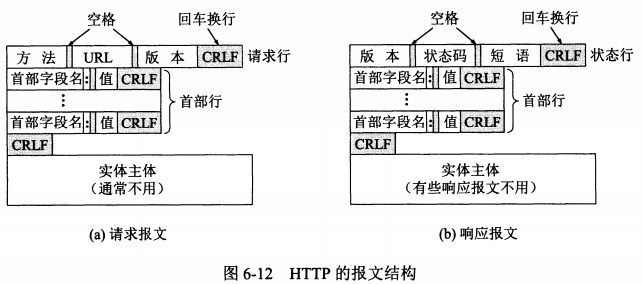

# 第六章 应用层

应用层作为TCP层服务的对象，非常接近我们使用的程序（或者本身就是，或者是程序的调用）。每个应用层协议都是为了解决某一类应用问题，而问题的解决必须通过位于不同主机中的多个应用进程之间的通信和协同工作来完成。于是乎，应用层协议应当定义：

+ 进程交换的报文类型。如请求报文和响应报文。
+ 各种报文类型的语法，如字段及其意义。
+ 字段的语义，即包含在字段中的信息的含义。
+ 进程何时、如何发送报文，以及对报文进行响应的规则。

## 6.1 域名系统DNS

### 6.1.1 域名系统概述

域名系统的本质是把网址名转换为IP。这主要是因为IP大部分人记不住，如果你家网络直接输入IP没问题但是输入网址就挂了，说明你家的DNS配置出现了问题。有人说可以只用一个DNS服务器处理所有的IP回答，这显然是不可取的，这个服务器可能要累死。于是早在1983年，互联网就采用层次树状结构的命名方法，并使用分布式的域名系统，称之为DNS[RFC 1034, 1035]。

DNS让大多数名字在本地进行解析，只有少量需要在互联网上通信。如果发现这玩意不知道是什么，就成为DNS的一个客户，放在DNS请求报文中，以UDP数据报方式发给本地域名服务器，如果服务器知道就回送，反之也成为DNS的一个客户。

### 6.1.2 互联网的域名结构

一个域名通过字符'.'分成若干个标号，每一个标号不超过63字符（主要是为了方便记忆，自己设定也不要太长），所有标号加在一起也不超过255字符，不区分大小写，除了'-'以外不能使用标点。

国际顶级域名分类：

+ 国家顶级域名nTLD：按照国家分类。
+ 通用顶级域名gTLD：按照行业分类。
+ 基础结构域名：arpa，用于反向域名解析。

除了顶级域名由ICANN规划以外（现在已经是申请+批准），而下级域名则完全由国家定义，域名除了和IP有映射关系以外，其他关系一概没有（下级域名和子网也没有关系）。

### 6.1.3 域名服务器

域名服务器是按照树结构放置的，一个服务器所管辖的范围叫做区，每一个区设置相应的权限域名服务器。除了权限域名之外，域名服务器可以化为四种不同的类型：

+ 根域名服务器：最高层次，也是最重要的，所有根域名服务器都知道所有顶级域名服务器的域名和IP地址。域名服务器非常多，但是这么多服务器只使用13个不同IP地址。每一个IP都是一种设备，即只有13种不同的设备，而查找则采用了任播技术，只要找到最近的一个就行了。
+ 顶级域名服务器：负责管理在顶级域名注册服务器的所有二级域名，当收到DNS查询请求时，就给出相应的回答。
+ 权限域名服务器：负责一个区的服务器。当一个权限域名服务器不能给出最后的查询回答时，就会告诉发出请求的DNS客户，下一步应当找哪一个权限域名服务器。
+ 本地域名服务器：没一个小地方都可以有一个，这种域名服务器有时也被称为默认域名服务器，如果玩的开心的话，建议把自家路由器也算进去。

需要注意的是：主机箱本地域名服务器的查询一般采用递归查询（要么给出IP，要么报错，如果自己不知道就往上面查），本地域名服务器向根域名服务器的查询是采用迭代查询（要么给出IP，要么告诉本地域名服务器该找谁）。


显然，在这样的查询过程中，应当类似于ARP进行布置缓存，以存储最近查询过的域名以及从何处拿到的。这种方式甚至不仅仅用在直接给出结果，也可以用在缩短查询链条，比如可以直接问dns.com的就没有必要问根域名服务器了。同样地，每个条目都有失效时间，这个会在DNS查询的响应中给出。

## 6.2 文件传送协议

### 6.2.1 FTP概述

FTP[RFC 959]其实算是一个非常著名的协议了，至少现在还在用。它属于文件共享协议的两个主要用途之一。

+ 复制整个文件，FTP就属于这一类。如果要存取一个文件，就必须先获得一个本地的文件副本；如果要修改文件，只能对文件的副本进行修改，然后把修改后的文件副本传回到源节点。
+ 联机访问，这意味着多个程序可以同时对一个文件进行存取。用户可以远地文件作为输入输出运行应用程序，操作系统的文件系统提供对共享文件的透明存取，透明存取的优点是让应用程序为了运行远地文件的修改不需要很大。

### 6.2.2 FTP的基本工作原理

FTP使用TCP，区分客户服务器，一个FTP可同时为多个进程提供服务，实现方式是一个主进程（接受新的请求），打开若干个从属进程（处理单个请求）。

+ 打开21端口，使客户可以连接上。
+ 等待客户发出连接请求。
+ 启动从属进程处理客户发来的请求。从属进程处理完了就关闭了，为了处理也可以创建其他一些子进程。
+ 主进程回到等待状态，这个是可以并发进行的。

从属进程中最重要的两个使控制进程和数据传送进程，这两个的端口通过21端口告诉客户端以供连接，前者发出控制信号（比如中止传输），后者实际负责数据传输。

FTP的处理不是最佳的，这点在大文件上体现非常明显。相对而言NFS（网络文件系统）记录修改方式的方式会更加省力。

### 6.2.3 简单文件传送协议TFTP

TFTP[RFC 1350]端口号69，相对于FTP而言：

+ 体积更小，易于实现。这特别适合于小容量的东西，广播拿数据直接丢内存跑。
+ 主要使用UDP进行传送，每次报文传送只有512字节（最后一次是模512的余数）。如果文件刚好是512的倍数，那么还要补发一个0字节的文件。
+ 数据报文按序编号，从1开始。
+ 工作机制很像**停止等待协议**，发送完一个文件块后等待对方的确认才可以发送另一个。

## 6.3 远程终端协议TELNET

TELNET[RFC 854]协议是简单的远程终端协议，只不过现在计算机的功能很强，用的越来越少了。为了适应不同操作系统的差别，TELNET定义了数据和命令怎样通过互联网，即NVT（网络虚拟终端），用这个作为中转把适配复杂度从二次方降低到线性。

## 6.4 万维网

### 6.4.1 万维网概述

万维网是一个大规模、联机式的信息储藏所，用链接的方法能非常方便的从互联网上的一个站点访问另一个站点，从而主动按需获取风飞的信息。万维网是分布式的超媒体系统，它是超文本系统的扩充。客户系统向服务器程序发出请求，服务器程序向客户程序送回客户所要的万维网文档。

+ 怎样标志分布在整个互联网上的万维网文档？解决方案：URL（统一资源定位符）
+ 用什么样的协议来实现各种链接？解决方案：HTTP（超文本传送协议）
+ 万维网文档如何制作？解决方案：HTML
+ 如何让用户很方便找到需要的信息？解决方案：搜索工具

### 6.4.2 统一资源定位符URL

URL本身的组成：<协议>://<主机>:<端口>/<路径>。协议即HTTP、FTP之类；主机可以是IP地址、域名；端口可以省略，表示端口号。

后面的路径可以有很多种解读方式。第一种是最常见的，把这玩意当文件夹和文件使用，如果最后是个文件夹，那么自动进入到文件夹内部的index.html进行处理。第二种是把这个东西交给一个全栈平台（或者后端软件）进行解析。

### 6.4.3 超文本传送协议HTTP

HTTP是面向事务的应用层协议，无连接无状态，使用TCP协议传输。在TCP的第三次握手时就可以发送HTTP请求报文，并等待HTTP响应报文。

HTTP主要有两个版本：HTTP/1.0[RFC 1945]每请求一个文档都要有$2RTT$的开销。如果一个主页上有很多链接的对象就是一堆$2RTT$的开销，这对于服务器而言可不是好事情，虽然浏览器能够打开5~10个并行的TCP连接，但是对于现在的图片数量而言，还是有点太多了。

HTTP/1.1[RFC 7231]允许持续链接，即完成数据传输之后一段时间依旧保持，而且不局限于同一个页面上，只要是一个服务器都可以，如果你手贱想关掉的话，可以去浏览器看看。除此以外，这玩意还支持两种工作方式，非流水线方式（吃时间）和流水线方式（吃机能）。

如果发现自己网络特别容易爆炸，可以考虑使用代理服务器，此时如果代理服务器有的这个页面，直接返回即可，反之帮浏览器拿到信息并存入缓存。

相对而言，HTTP报文内容可能更加反人类一点，不过就两类报文了。HTTP报文时面向文本的，每一个字段都是ASCII码串，都分为开始行、首部行、实体主体。



请求报文中，方法可以有很多种：

| 方法    | 意义                       |
| ------- | -------------------------- |
| OPTION  | 请求一些选项的信息         |
| GET     | 请求读取URL                |
| HEAD    | 请求读取URL的首部          |
| POST    | 给服务器添加信息           |
| PUT     | 在指明的URL下存储一个文档  |
| DELETE  | 删除指明的URL所标志的资源  |
| TRACE   | 用来进行环回测试的请求报文 |
| CONNECT | 用于代理服务器             |

一个典型的HTTP请求报文：

```
GET /dir/index.htm HTTP/1.1
Host: www.xyz.edu.cn
Connection: close           // 传输完了可以立即释放
User-Agent: Mozilla/5.0
Accept-Language: cn         // 优先中文
                            // 这个空行属于格式内容
```

响应报文的最大特点是[状态码](https://zh.wikipedia.org/wiki/HTTP状态码#1xx消息)，一开始[RFC 2616]33种，后来又加了几种[RFC 6585]，分五大类：

- 1xx：指示信息--表示请求已接收，继续处理。
- 2xx：成功--表示请求已被成功接收、理解、接受。
- 3xx：重定向--要完成请求必须进行更进一步的操作。
- 4xx：客户端错误--请求有语法错误或请求无法实现。
- 5xx：服务器端错误--服务器未能实现合法的请求。

HTTP无状态的特点给服务器减压效果非常不错。但是对于一些需要记忆的内容而言则有一点问题，因此选择在本地加入了Cookie[RFC 6525]的设计。第一次产生在响应报文中，以Set-cookie字段实现，之后用在请求报文中则是Cookie字段

## 6.5 电子邮件

### 6.5.1 电子邮件概述

电子邮件最重要的两个协议是SMTP[RFC 5321]和互联网文本报文格式[RFC 5322]。在1993年提出了互联网邮件扩充（MIME）来解决只能发送7位ASCII的问题。用户通过SMTP发送邮件到自己的服务器，自己的服务器通过SMTP发送到接收方邮件服务器，而收件人通过POP3来读取邮件。SMTP和POP3都是走TCP连接的。

因为直接敲命令行实在过于蛋疼，所以有人写了一套UI，叫做用户代理，为发送和接收邮件提供一个很好的接口，需要实现撰写、显示、处理、通信四个功能。

需要注意的一点是：有些应用提供了把右键直接往接收方邮件服务器里面怼的功能，这在很多服务器中并不吃香，因为怀疑垃圾邮件和计算机病毒，就很容易拒收。

在TCP/IP体系中，邮件地址规定为：用户名@邮件服务器的域名。

### 6.5.2 简单邮件传送协议SMTP

连接建立要做的事情：

+ TCP连接建立。端口一般是25，如果成功建立，对方要发`220 Service Ready`。
+ 客户端往服务器发HELO命令，附上自己的主机名。如果对方有能力接收邮件，回答`250 OK`，反之回答`421 Service not available`。
+ 要注意的是SMTP不使用中间的邮件服务器。

邮件传送需要做的事情：

+ 发送MAIL FROM命令，需要跟自己的地址。如果服务器可以接受，回答`250 OK`，反之代码很多，比如`451`（处理时出错），`452`（空间满了），`500`（命令无法识别）。
+ 跟着一个或者若干个RCPT TO命令，一个RCPT跟一个收件人地址。如果SMTP服务器发现这个地址在接收方系统里，返回`250 OK`，反之返回`550 No such user here`或者其他错误码。
+ DATA命令发送数据。服务器返回的信息是`354 Start mail input; end with <CRLF>.<CRLF>`，即两个回车可以完成输入。输入完了即可发送，服务器收到了就返回`250`

连接释放需要的事情是就是QUIT命令，返回`221`即可完成。

### 6.5.3 电子邮件的信息格式

电子邮件分为信封和内容两大部分，在RFC 5322中只定义了首部格式，但是主体部分则要用户自由编写。To表示收件人，Subject表示邮件的主题，From表示发件人，Date表示发件日期，Cc表示抄送，Reply-To表示会信用的地址。有的邮件系统也支持Bcc以支持“希望收件人不知道谁抄送的”这个事情。

### 6.5.4 邮件读取协议POP3和IMAP

以下是POP3报文的内容：

| 命令 |    参数     | 状态 |                         描述                         |
| :--: | :---------: | :--: | :--------------------------------------------------: |
| user |  username   | 认可 |     此命令与下面的pass命令若成功，将导致状态转换     |
| pass |  password   | 认可 |                                                      |
| apop | name,digest | 认可 |     一种安全传输口令的办法，执行成功导致状态转换     |
| stat |    none     | 处理 |  请求服务器发回邮箱的统计资料，如邮件总数和总字节数  |
| uidl |   [msg#]    | 处理 |       返回邮件的唯一标识符，一个会话拥有一个ID       |
| list |   [msg#]    | 处理 |             返回邮件数量和每个邮件的大小             |
| retr |   [msg#]    | 处理 |            返回由参数标识的邮件的全部文本            |
| dele |   [msg#]    | 处理 |  服务器将由参数标识的邮件标记为删除，由quit命令执行  |
| rset |    none     | 处理 |  服务器将重置所有标记为删除的邮件，用于撤消dele命令  |
| top  |  [msg#],n   | 处理 | 服务器将返回由参数标识的邮件前n行内容，n必须是正整数 |
| noop |    none     | 处理 |       服务器返回一个肯定的响应，不做任何操作。       |
| quit |    none     | 更新 |                         退出                         |

相对于POP3而言，IMAP的实际操作回更加复杂，它有点综合了SMTP和POP3。这两个东西最大的不同则是IMAP是个在线协议，所有操作都是同步到云端的，而POP3则像个离线协议，仅在客户端内。

### 6.5.6 通用互联网邮件补充MIME

SMTP有一些缺点：

+ SMTP不能传送可执行文件或其他二进制对象。
+ SMTP限于传送7位的ASCII码，许多非英语国家的文字没法传送。
+ SMTP服务器回拒绝超过一定长度的邮件。
+ 某些SMTP的实现并没有完全按照SMTP的互联网标准。比如：回车、换行的删除和增加；超过76字符的处理不对；对于空格的删除；将制表符换成若干个空格。

因此引出了MIME（通用互联网邮件扩充）[RFC 2045~2049]，以MIME中转用户的输入，将其转化为SMTP可以看懂的形式进行传输，这并没有影响SMTP。MIME新增了五个首部：

+ MIME-Version：MIME的版本。如果没有这个就是纯英文文本。
+ Content-Description：可读字符串，说明邮件主体是图像、音频或视频。
+ Content-Id：邮件的唯一标识符。
+ Content-Transfer-Encoding：主体如何编码。
+ Content-Type：邮件主体数据类型和子类型。

MIME中三种常用的内容传送编码如下：

+ 最简单的ASCII编码，每行不超过1000字符。MIME对于这玩意不进行任何转换。
+ 用于少量非ASCII编码的quoted-printable，利用`=`作为特殊编码的开头，一个字节一个`=`，转换的部分体积变为300%，`=`则变为=3D。
+ 对于二进制编码，可以采用base64编码。编码方法划分为24位，每个24位划分为四个六位组，之后A-Z一排，小写一排，十个数字，+和/分别代表0-25，26-51，52-61，62和63。在用两个连在一起的等号“==”和一个“=”分别表示最后一组的代码只有8位或者16位，回车换行都忽略。

## 6.6 动态主机配置协议DHCP

### 6.6.1 报文

DHCP基于UDP进行传输，客户端用67端口号，服务器用68端口号。DHCP的一共有八种报文，用的都是同一个模板：

| Names          | Length  | Meaning                                                      |
| :------------- | :------ | :----------------------------------------------------------- |
| 报文类型       | 1字节   | 1是客户端请求报文，2是服务器响应报文。                       |
| 硬件地址类型   | 1字节   | 1对应以太网。                                                |
| 物理地址长度   | 1字节   | 单位是字节。6对应以太网MAC。                                 |
| 中继计数       | 1字节   | 出发时为0，每过一个中继则该字段+1。可以此限制经过数目。      |
| 事件ID         | 4字节   | 由客户端选择的一个随机数，用于对服务器和客户端之间的暗号。   |
| 秒数           | 2字节   | 由客户端填充，表示从获得IP地址或续借后使用的秒数。           |
| 标记字段       | 2字节   | 只有最高位有用，表示广播响应标志位，0表示客户端请求服务器以单播形式发送响应报文，1表示广播形式。其他位填0。 |
| 客户端IP       | 4字节   | 如果有则填自己的IP，反之则是初始化状态，全部填0。            |
| 分配给客户的IP | 4字节   | 服务器进行DHCP响应时，将分配给客户端的IP地址填入。           |
| 服务器IP       | 4字节   | DHCP客户端获得启动配置信息的服务器的IP地址。                 |
| 中继IP地址     | 4字节   | 第一个DHCP中继的IP地址。如果服务器和客户端不在同一个网络中，那么第一个DHCP中继在转发这个DHCP请求报文时会把自己的IP填入。服务器会根据此字段来判断出网段地址，还会以该IP为中继，将响应报文交给客户端。如果不止一个中继也不会改变这个字段只是计数+1。 |
| 客户端硬件地址 | 16字节  | 填入即可，多了的填0。                                        |
| 服务器名字     | 64字节  | 客户端获取配置信息的服务器名字，此字段由DHCP服务器填写，可选。如果填写，必须是一个以'\0'结尾的字符串。 |
| 启动配置文件   | 128字节 | 客户端的启动配置文件名，此字段由DHCP服务器填写，可选。如果填写，必须是一个以'\0'结尾的字符串。 |
| 选项           | 可变    | 该字段表示DHCP的选项字段，至少为312字节，格式为”代码+长度+数据”。DHCP通过此字段包含了服务器分配给终端的配置信息，如网关IP地址，DNS服务器的IP地址，客户端可以使用IP地址的有效租期等信息。 |

对于最后的选项字段，都是如下套路。选项列表可以在[这里](https://cshihong.github.io/2017/12/09/DHCP/)查询。

| 字段  | 长度  |
| :---- | :---- |
| 类型  | 1字节 |
| 长度L | 1字节 |
| 内容  | L字节 |

通常来说会有两种情况：第一次连接和后续接入。

### 6.6.2 DHCP连接


第一次链接内容是1-4部分，数字靠近的地方则是报文的发起人。

1. 每次接入时，都要发送Discover报文，并且是广播发送。如果存在中继，那么在到第一个DHCP中继之后转为单播。
2. 收到Discovcer报文的DHCP服务器都需要发出Offer报文。这会导致DHCP客户端会收到多个报文。
3. 选择一个服务器发送Request报文。一般是第一个。
4. 如果对方确认的话，则发送Ack报文确认IP的占用，并设定两个计时器，一个是租用期的一半，一个是租用期的$\frac{7}{8}$。

对于租用期则是有如下的工作机制。

+ 当租期达到50%时，客户端会向DHCP服务器单播Request报文，请求更新IP地址租期。
+ 当租期达到87.5%时，如果仍未收到服务器的应答，客户端自动向服务器广播Request报文。
+ 如果收到服务器回应的Ack报文，则租期从0开始计算；如果收到Nak报文，则重新发送Discover报文请求新的IP地址。
+ 如果租期时间到时都没有收到服务器的回应，客户端停止使用此IP地址，重新发送Discover报文请求新的IP。

如果需要重新申请IP，就需要

1. 重新发送一遍Request报文。报文中的Option50填入使用过的IP地址。
2. 如果服务器不接受，则直接沉默，等对方重新开始。

## 6.8 应用进程跨越网络的通信

### 6.8.1 系统调用和应用编程接口

大多数操作系统使用系统调用的机制在应用程序和操作系统之间传递控制权。有些系统调用接口又称为应用编程接口API，这类系统调用在被调用之前需要写一些东西以算出参数。同时为了和TCP/IP协议进行匹配，有一种最著名的API叫做套接字接口，Windows也弄了一套叫做WinSock。

当应用进程需要使用网络进行通信时，首先发出socket系统调用，请求操作系统为其创建一个套接字，把系统资源分配过来，并返回一个套接字描述符的号码。应用程序所进行的网络操作都必须使用这个套接字描述符（套接字描述符也是套接字函数的第一个参数）。通信完毕后，应用进程通过一个close来通知系统回收套接字描述符相关的资源。

### 6.8.2 几种常用的系统调用

一种常见的系统调用是：

+ 套接字创建后，端口号和IP都是空的。此时用bind来指明套接字的本地地址，如果是客户端也可不用调用，全部交给操作系统管理。
+ 服务器调用bind后，还必须要有listen设置为被动模式，用accept接受远地客户发来的连接请求。由于accept需要并发，可以采用类似ftp的方式，一个套接字用来接，创建完了就不管了，交给其他CPU处理。
+ 对应的客户进程则是connect，这时主动打开，在连接中，客户必须指明远地端点。
+ 使用send和recv来收发数据，用close来关闭。
+ 如果是UDP等无连接协议，没有listen和accept。

## 6.9 P2P应用

P2P的技术特点上时不需要使用集中式的媒体服务器，这个让很多普通用户的计算机充当了。

在互联网流量中，这种方式的文件分发占据了最大的份额，比万维网应用所占的比例大得多。同时应用范围也早就不限于文件分发，在金融、会议、数据库等方面都有了很高的应用。

### 6.9.1 具有集中目录服务器的P2P工作方式

最早的P2P应用是Napster，在这个依旧存在服务器的应用中，服务器不再提供存储的功能，而是记录有这个文件的计算机。只要有人想下载文件，就先询问服务器哪些人有，拿到列表之后一个一个ping，只要能连接建立就可以进行传输。这种方法的两大问题是性能瓶颈（查找很费时间）和侵犯版权。

### 6.9.2 具有全分布式结构的P2P共享文件程序

使用过P2P下载的（比如校园PT或者公网BT）的都会知道，文件是分块下载的，分块可大可小，不过一般最大4MB。文件被文件块等分出来，所有用户中有的可能会有所有的块，有的有一部分，有的刚刚开始下载，什么都没有。通常来说用户是希望把所有的数据都拿过来的，不然自己用不了是几个意思？

在BitTorrent的实现中（注意，这样的软件有很多，每个软件也有不同的叫法，但是大致意思是差不多的），参与某一个文件分发的所有对等方称为一个洪流。一个刚加入的没有文件块，随着时间可以拿到一些，并随之变多。有的用户拿完了所有的就立即退出洪流，也有的会留在洪流中，这个是用户的自由。不过为了稳定这个洪流，大部分PT站点会以等效上传量/等效下载量来刺激用户尽力上传。同时在现在的情况下，软件只要使用相同的协议，就可以交互，比如qbittorrent可以拿到transmission文件。

每一个洪流都有一个基础设施节点，叫做tracker，当一个对等方加入洪流时，必须向追踪器登记，并周期性告知tracker它在洪流中，这样一个洪流可能会有数百个甚至数千个用户。在一个新的对等方进入洪流时，tracker会随即从对等方集合中选择若干个告知给它，使其可以建立TCP连接。

由于一个用户可以从其他对等方拿到数据块，所以可以获得更快的下载速度，但是要注意的是：

+ 哪些数据块时首先需要向其他对等方请求的？这个是最稀有的优先，因为如果那些有稀有数据块的一旦撤了就不知道什么时候能回来了。
+ 想自己请求的相邻对等方这么多，因该向谁发送文件块？在BT的想法中，数据率最高的若干个优先。这个数据率最高是每过一段时间就要重新统计的，甚至每过另一段时间就要强制改变一个相邻对等方发送文件。

### 6.9.4 在P2P对等方中搜索对象

感觉这块做的不好。。。