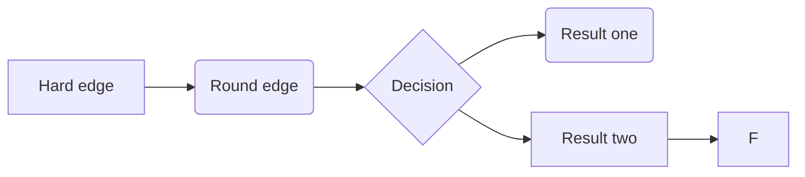

# 第二章 一个简单的语法制导翻译器

本章将会介绍一个语法制导翻译器，首先把一个中缀算术表达式转换成后缀表达式，然后扩展这个东西，使其能够生成三地址代码的程序片段。前一部分代表了3-6章的技术，后一部分则是代表7-8章的。

## 2.1 引言

分析阶段的工作是按照语法来展开的，一个程序设计语言的**语法**描述了怎么写编译器才看得懂，而**语义**则定义了程序的含义，告诉了机器应该做些什么。

2.2中会介绍上下文无关文法（BNF）来介绍语法。同时，上下文无关文法还可以知道程序的翻译过程，2.3中就会介绍语法制导翻译技术，分析会在2.4中介绍。

词法分析器使翻译器可以处理多个字符组成的构造，比如标识符，在这个阶段下，这类东西会被当成一个**词法单元**来处理，2.6介绍的词法分析器允许表达式中出现数值、标识符和空白字符。

接下来有两种中间代码形式，一种被称为**语法树**，也被称为**抽象语法树**，它表示了源程序的层次语法结构；第二种就是三地址代码

## 2.2 语法定义

请注意这样的表达式：$stmt\rightarrow if(expr)\ stmt\ else\ stmt$，这种规则成为产生式，其中像if () else这一类的都可以作为终结符号（词法单元），其他的被称为非终结符号。

### 2.2.1 文法定义

一个上下文无关文法由四个元素组成：

1. 一个终结符号集，有时也被称为词法单元，基本符号的集合。
2. 一个非终结符号集，有时也被称作语法变量，一个非终结符号通常会被分解为多个终结符号，但是怎么分解的取决于不同的产生式。
3. 一个产生式集合，这个集合包括很多个类似于$stmt\rightarrow if(expr)\ stmt\ else\ stmt$的情况，每个产生式由产生式头（左部）和产生式体（右部）两部分，用来完成从左到右的分解方式。一个产生式有可能递归产生自己，也可能会有多种产生方式，这意味着递归和分支，给语法提供了不同的形式。
4. 指定一个非终结符号作为开始符号。

不过对于当前的文法来看，基本都是处在对于字符串进行处理，因为这个和编译器拿取源代码的行为是一样的。如果对于一个串，分解出来其实是什么都没有（即零个终结符号），那么这样的串被称为$\epsilon$。

### 2.2.2 推导

可以从开始符号推导得到的所有终结符号串集合称为该文法定义的语言。

**语法分析**的任务是，接受一个终结符号串作为输入，找初从文发的开始符号推导出这个串的方法，如果做不到则报告语法错误。

### 2.2.3 语法分析树

一个语法分析树是一个具有如下性质的树：

1. 根节点的标号为文法的开始符号。
2. 每个叶子节点的标号为一个终结符号或者是$\epsilon$。
3. 每个内部结点的标号为一个非终结符号，产生式的内容则按照终结符号和非终结符号单独从左往右列举作为其子节点。注意，产生式只能对当前非终结符号进行处理，不要越级到下一层非终结符号。

**一个文法的语言**的另一个定义是指任何能够由某棵语法分析树产生的符号串的集合。为一个给定的终结符号串构建一棵语法分析树的过程被称为对该串进行**语法分析**。

### 2.2.4 二义性

注意，你随便写的一个文法都可能会具有二义性，这里和标题的二义性都是字面意思，如果对与一个串，有两棵语法树可以描述这个东西，那就是具有二义性。

### 2.2.6 运算符的优先级

这里会有一个非常经典的例子：
$$
expr\rightarrow expr+term\ |\ expr-term\ |\ term
$$

$$
term\rightarrow term*factor\ |\ term/factor\ |\ factor
$$

$$
factor\rightarrow digit\ |\ (expr)
$$

以后会经常出现，因为四则运算已经是众所周知，而且特别注意到了二义性，运算优先级，在左递归中也会有出现。从expr开始，距离expr越近的在语法分析树的高度也就越高，这意味着运算越靠后，借此完成了加减号的低优先级要求。

### 2.2.7 2.2的练习

## 2.3 语法制导翻译

### 2.3.1 后缀表示

### 2.3.2 综合属性

### 2.3.3 简单语法制导定义

### 2.3.4 树的遍历

### 2.3.5 翻译方案

### 2.3.6 2.3的练习

## 2.4 语法分析

### 2.4.1 自顶向下分析方法

### 2.4.2 预测分析法

### 2.4.3 何时使用$\epsilon$表达式

### 2.4.4 设计一个预测分析器

### 2.4.5 左递归

### 2.4.6 2.4的练习

## 2.5 简单表达式的翻译器

### 2.5.1 抽象语法和具体语法

### 2.5.2 调整翻译方案

### 2.5.3 非终结符号的过程

### 2.5.4 翻译器的简化

### 2.5.5 完整的程序

## 2.6 词法分析

### 2.6.1 剔除空白和注释

### 2.6.2 预读

### 2.6.3 常量

### 2.6.4 识别关键字和标识符

### 2.6.5 词法分析器

### 2.6.6 2.6的练习

## 2.7 符号表

### 2.7.1 为每个作用域设置一个符号表

### 2.7.2 符号表的使用

## 2.8 生成中间代码

### 2.8.1 两种中间表示形式

### 2.8.2 语法树的构造

### 2.8.3 静态检查

### 2.8.4 三地址码

### 2.8.5 2.8的练习